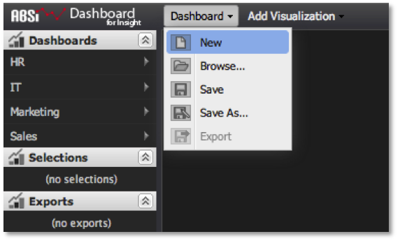

# 建立控制面板{#creating-a-dashboard}

即使是針對短期臨機分析需求，也建議建立控制面板。

>[!NOTE]
>
>唯讀使用者無法建立控制面板。 本節僅適用於一般使用者和管理員。

使用者可基於下列幾個原因決定建立控制面板：

* 新控制面板可從頭開始，以便即時分析，而不需重複使用或共用控制面板。
* 您可以建立新的控制面板，以執行您自己要儲存並重複使用但不要共用的個人分析。
* 您可以建立、儲存和共用新控制面板，並讓其他控制面板使用者人數加以存取。 無論如何，每種情形都從同一點開始：空白控制面板畫布。

>[!NOTE]
>
>在開始建立控制面板之前，最好將「查詢至」百分比降低至較低，例如10%或25%。 這會比執行完整查詢更快從資料工作台提取資料樣本。 由於這些取樣結果傳回的速度要快得多，因此在構成控制面板和分析框架時，可提供理想的回應速度。 在您準備好執行查詢以完成後，就可以將查詢至參數更新為100%。 如需調整查詢完成，請參 [閱查詢至參數](../../../home/c-adobe-data-workbench-dashboard/c-dashboards/c-query-to-parameter.md#concept-33db106e28bc4108bca9e8d0a440d323)。

若要建立新控制面板，請在「控制面板」 **[!UICONTROL New]** 選單下選取。

您將會看到空白的控制面板畫布，可根據您的分析需求新增和設定視覺化。 當您工作時，伺服器上不會有任何更新，直到您儲存為止。

接下來，決定您要顯示何種資料，以及要如何顯示。 一般來說，從表格視覺化開始查看原始資料，然後建立其他適合的圖表會有所幫助。 如需如何新增及設定視覺化的詳細資訊，請參閱「建立 [視覺化」](../../../home/c-adobe-data-workbench-dashboard/c-visualizations/t-creating-visualizations.md#task-c6f1d20fa2484aeeb9a8487625054ecf)。 新增並設定視覺化以建立控制面板後，您會得到下列結果：

此時，您只需執行分析並捨棄控制面板，或選擇將控制面板儲存至伺服器，以重複使用和／或共用。 如需如何與控制面板互動以執行分析的詳細資訊，請參閱控制 [面板中的選取部分](../../../home/c-adobe-data-workbench-dashboard/c-making-selections-within-the-dashboard/c-making-selections-within-the-dashboard.md#concept-0989862de0044cc4bbfd7f4441275fc4)。
