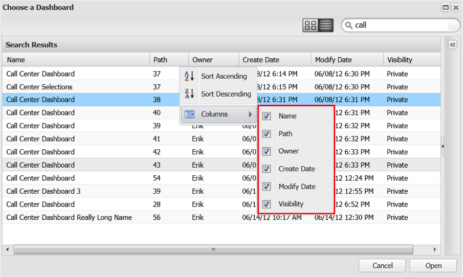

# 在控制面板瀏覽器中搜尋{#searching-within-the-dashboard-browser}

「控制面板瀏覽器」也可讓您執行搜尋，以尋找現有的控制面板。

若要執行搜尋，請使用「控制面板瀏覽器」工具列中的搜尋方塊。 您的搜尋結果會在您輸入時顯示在控制面板瀏覽器中。 您可以隨時刪除搜索文本或按一下搜索框中的&#x200B;**[!UICONTROL X]**&#x200B;表徵圖來清除搜索。

您也可以使用每個欄標題中的排序函式來排序結果。 按一下欄標題將切換該欄的排序。 您也可以使用每個欄標題上的下拉式功能表來存取排序選項。

此&#x200B;**[!UICONTROL Columns]**&#x200B;菜單還允許您修改控制面板清單視圖中的可見列。 在這裡，您可以選取或取消選取所選欄，以切換欄的可見性。

## 詳細資訊面板{#section-e1e5a5a0f9cc4eb89b0b94764587ae9c}

「控制面板詳細資訊面板」會顯示控制面板的詳細資訊以及控制面板的縮圖版本。 面板中的資訊包括控制面板的名稱、簡短說明、擁有者和建立日期、上次修改日期，以及用來建立控制面板的描述檔。 控制面板的可見度（無論是私用或共用）也可在此面板中使用。
