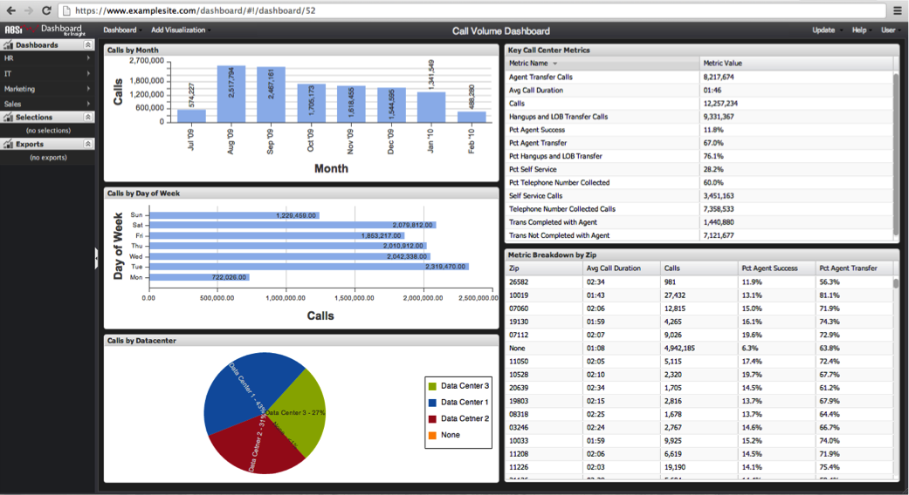

# 控制面板超連結{#dashboard-hyperlink}

控制面板的第三個開啟方式是使用控制面板的超連結。

每個控制面板都有一個唯一的超連結，可用來透過瀏覽器的位址列開啟控制面板。 控制面板超連結也可用於透過電子郵件建立書籤和共用。

如果您有控制面板的超連結，只需將它輸入瀏覽器的位址列，並導覽至連結即可。 您將會被導向至控制面板網站並提示登入（如果尚未登入）。 登入後，控制面板就會載入介面。

>[!NOTE]
>
>如果控制面板已不存在或您沒有存取控制面板的適當權限，系統會提示您訊息。

