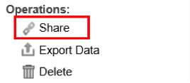
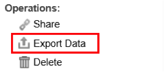

# 其他控制面板函式{#other-dashboard-functions}

特殊功能包括共用、匯出和刪除控制面板，並從選取控制面板的詳細資訊面板執行。

## Sharing a Dashboard Hyperlink {#section-16b592f157de404fb25bd2c739d2e2c1}

此 **[!UICONTROL Share]** 操作提供URL，可用來為控制面板建立書籤或寄送連結給其他使用者以存取控制面板。 將會出現「控制面板連結」視窗，提供您共用連結至所需控制面板所需的資訊。

>[!NOTE]
>
>連結的收件者也必須擁有控制面板的存取權，才能檢視控制面板。

## 匯出控制面板資料 {#section-ace2f5f8807548ee8436f5c1dc2cd9d2}

此操 **[!UICONTROL Export Data]** 作會開始匯出選取的控制面板，以儲存為Excel或CSV（逗號分隔值）檔案。

## 刪除控制面板 {#section-adc10cb1b3174ff699c024ddc8f994fa}

操 **[!UICONTROL Delete]** 作將刪除控制面板。 若要刪除控制面板，使用者必須是控制面板的擁有者或擁有管理員存取權。 按一下「刪除」操作會顯示一個視窗，以確認您要刪除控制面板。

