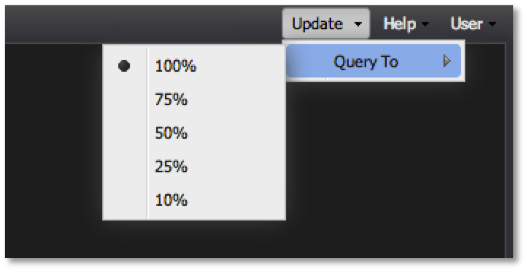

# 查詢完成度參數{#query-to-parameter}

控制面板可讓您視覺化Adobe資料工作台的資料範例，而不是將資料集查詢至完成。

由於範例結果會快速傳回，因此使用&#x200B;**[!UICONTROL Query To]**&#x200B;百分比較低的功能有助於快速建立和分析控制面板，直到傳回完整結果為止。 使用工具列的&#x200B;**[!UICONTROL Update]**&#x200B;功能表中的&#x200B;**[!UICONTROL Query To]**&#x200B;功能表，您隨時都可輕鬆調整&#x200B;**[!UICONTROL Query To]**&#x200B;參數。

由於執行查詢至100%完成可能需要幾分鐘的時間，因此建議您在建立控制面板時將&#x200B;**[!UICONTROL Query To]**&#x200B;參數調整為較低值，或新增及設定視覺化。 此外，建議在微調控制面板中的選取範圍時降低此值，直到您確定已準備好執行查詢至100%完成為止。

>[!NOTE]
>
>對於沒有100%完整查詢結果的每個視覺化，標題中會顯示一個指標。

