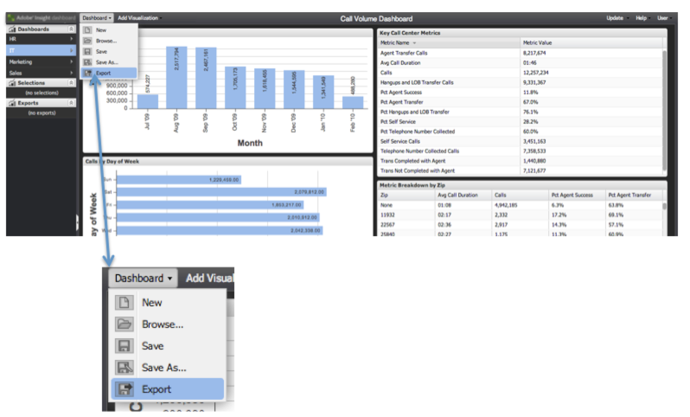

# 匯出資料{#exporting-data}

顯示3種匯出資料的方式，以及如何擷取匯出。

資料可從控制面板以三種方式匯出。

首先，您可以從個別視覺化匯出資料。 其次，您可以匯出目前的工作控制面板，包括您所做的任何設定和選擇。 第三，您可以匯出儲存的控制面板，而不需開啟它。

導出是使用兩個步驟的過程執行的。 首先，使用上述三種方法之一，在伺服器上排入匯出佇列。 當準備匯出時，匯出狀態會顯示在&#x200B;**[!UICONTROL Exports]**&#x200B;功能表中。 接著，當匯出準備就緒時，您可以下載CSV或Excel格式的資料。

匯出可能需要幾分鐘的時間，但您可以在匯出期間繼續使用應用程式。

## 匯出視覺效果 {#section-46b74b46c2eb44129c8b85a9eabd2304}

若要從視覺化匯出資料，請按一下視覺化工具選單中的&#x200B;**[!UICONTROL Save]**。

您的匯出作業將在伺服器上啟動，而匯出指示器會新增至「匯出功能表」。

## 匯出控制面板{#section-27329f2a5fed44b49deb26dc5164531f}

要從工作控制面板啟動資料導出，請從&#x200B;**[!UICONTROL Dashboard]**&#x200B;菜單中選擇&#x200B;**[!UICONTROL Export]**。

您的匯出作業將在伺服器上啟動，而匯出指示器會新增至「匯出功能表」。

## 匯出儲存的控制面板{#section-e989f7b16e25479ab77454f2c34471ba}

若要從儲存的控制面板啟動資料匯出，請使用控制面板瀏覽器。 在「控制面板瀏覽器」中，瀏覽至您想要的控制面板並加以選取，以便顯示控制面板的詳細資料。 在右側的詳細資訊面板的&#x200B;**[!UICONTROL Operations]**&#x200B;部分下，選擇&#x200B;**[!UICONTROL Export Data]**。

您的導出將在伺服器上啟動，並將導出指示符添加到&#x200B;**[!UICONTROL Exports]**菜單
.

## 檢索導出{#section-0f03c5321c804867b7c72cf92f6f67d0}

匯出完成時，會出現快顯通知，通知您匯出已就緒。

要檢索導出，請使用&#x200B;**[!UICONTROL Exports]**&#x200B;菜單。 按一下所要匯出項目右側的綠色核取標籤，將會顯示下拉式功能表。 在此功能表中，在&#x200B;**[!UICONTROL Save Export As…]**&#x200B;子功能表下，選取適當的功能表選項，以下載CSV或Excel格式的匯出。

您瀏覽器的檔案下載程式現在會開始。

匯出不會自動移除，因此您可以輕鬆下載每種格式的匯出。 您可以從左側導覽面板的&#x200B;**[!UICONTROL Exports]**&#x200B;功能表移除匯出。 否則，當您登出時，會自動移除這些檔案。

要從&#x200B;**[!UICONTROL Export List]**&#x200B;中刪除導出，請按一下導出標題右側的複選標籤，然後選擇&#x200B;**[!UICONTROL Remove From List]**。

