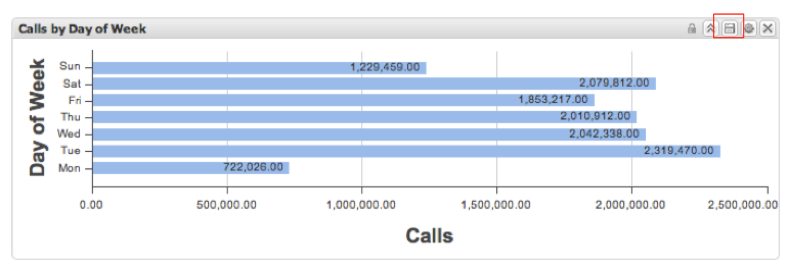

# 匯出資料{#exporting-data}

{{eol}}

顯示匯出資料的 3 種方法以及如何擷取匯出。

可以透過三種方式從儀表板匯出資料。

首先，您可以從個別視覺效果中匯出資料。 其次，您可以匯出目前的工作儀表板，包括您所做的任何設定和選擇。 第三，您可以匯出已儲存的儀表板而無需開啟它。

匯出作業是透過兩步驟程序來進行。首先，使用上述三種方法之一將匯出佇列在伺服器上。在準備匯出時，匯出狀態會顯示在「**[!UICONTROL 匯出]**」選單中。接下來，當匯出準備就緒後，您可以下載 CSV 或 Excel 格式的資料。

匯出可能需要幾分鐘的時間，但您可以在匯出期間繼續使用應用程式。

## 匯出視覺效果 {#section-46b74b46c2eb44129c8b85a9eabd2304}

若要從視覺效果匯出資料，請在視覺效果的工具選單中按一下「**[!UICONTROL 儲存]**」。

您的匯出將在伺服器上起始，並且會將匯出指示器新增至匯出選單。

## 匯出儀表板 {#section-27329f2a5fed44b49deb26dc5164531f}

若要從工作儀表板起始資料匯出，請從「**[!UICONTROL 儀表板]**」選單選取「**[!UICONTROL 匯出]**」。

您的匯出將在伺服器上起始，並且會將匯出指示器新增至匯出選單。

## 匯出已儲存的儀表板 {#section-e989f7b16e25479ab77454f2c34471ba}

若要從已儲存的儀表板中啟動資料匯出，請使用儀表板瀏覽器。 在儀表板瀏覽器中，瀏覽至所需的儀表板並選取，便會顯示儀表板的詳細資料。 在右側詳細資料面板中的「**[!UICONTROL 運作]**」區段下，選取「**[!UICONTROL 匯出資料]**」。

您的匯出將在伺服器上起始，並且會將一個匯出指示器新增至「**[!UICONTROL 匯出]**」選單。

## 擷取匯出 {#section-0f03c5321c804867b7c72cf92f6f67d0}

匯出完成後，會出現快顯通知，通知您匯出已準備就緒。

若要擷取匯出，請使用「**[!UICONTROL 匯出]**」選單。在所要匯出項目的右側按一下綠色勾選記號，系統顯示一個下拉選單。在此選單的「**[!UICONTROL 將匯出另存為...]**」子選單下，選取適當的選單選項並下載 CSV 或 Excel 格式的匯出內容。

您瀏覽器的檔案下載程序現在會啟動。

匯出不會自動移除，因此您可以輕鬆下載每種格式的匯出。您可以從左側導覽面板中的「**[!UICONTROL 匯出]**」選單移除匯出。否則，這些匯出將在您登出時自動移除。

若要從「**[!UICONTROL 匯出清單]**」中移除匯出，按一下匯出標題右側的勾選記號並選取「**[!UICONTROL 從清單中移除]**」。

