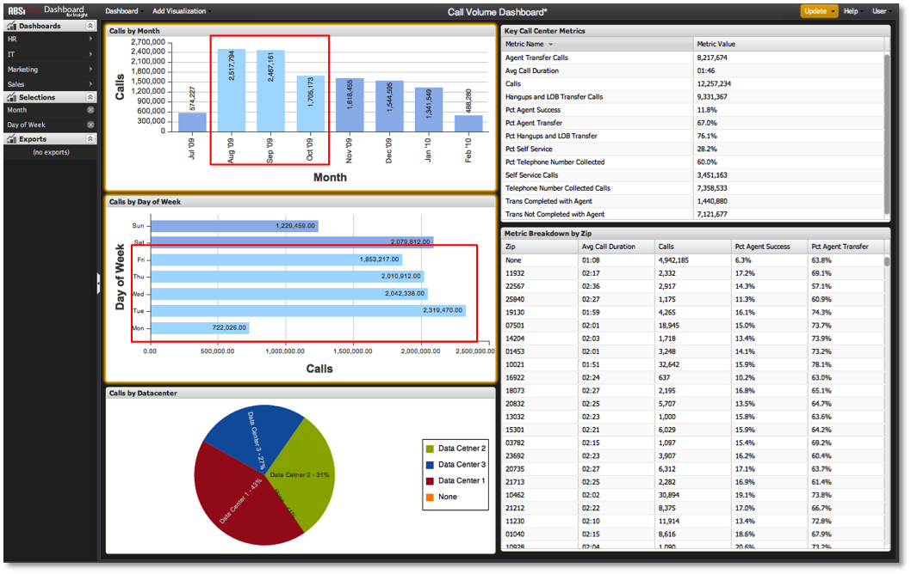

# 在控制面板中進行選取{#making-selections-within-the-dashboard}

使用選取範圍，可輕鬆劃分和探索控制面板中的資料。

在視覺化中按一下特定元素以識別控制面板中資料的分段方式，即可進行選取。 在某個視覺化中選取某個視覺化項目，會將控制面板內其他視覺化中所呈現的資料分段。 您可隨時選擇、調整或移除任何數目的選項，並鼓勵使用者與資料互動以衍生分析資訊。

儲存控制面板時，任何選取範圍的狀態都會在儲存時保留。 同樣地，當載入控制面板時，在儲存期間保留的任何選取項目都會在載入控制面板時生效。

按一下控制面板的視覺化中的一或多個資料元素，即可進行選取。 資料元素由長條圖中的長條、柱圖中的欄、表格中的列等來表示。 選取範圍會在選取時加亮顯示，在視覺化中選取範圍會讓視覺化呈現橙色邊框。 選取的精確方法取決於所使用的視覺化類型。

對於從視覺化中建立的每個選取範圍，「選取範圍」選單中也會出現一個項目。 此項目會使用選取的維度名稱列出，每個視覺化會顯示一個選取項目。

>[!NOTE]
>
>視覺化資料不會在每次選取時自動更新。 您必須在完成所需的選擇後，開始更新，才能區隔資料並更新視覺化。
