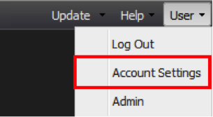

# 使用者帳戶管理{#user-account-management}

有關如何存取帳戶設定和變更密碼的資訊。

## 存取您的帳戶資訊{#section-7c39e79d8d6445059c9a6237e140bc6a}

若要存取您的帳戶資訊，請從「使用者」選單中選取「帳戶設定」。

將會出現一個視窗，詳細說明您的帳戶資訊。 這包括您的使用者名稱、電子郵件地址、群組成員資格，以及可供您使用的資料設定檔。 若要確認您的使用者設定檔已正確設定，且您擁有所有資料設定檔的存取權，您可以檢閱「已授予存取權」區段中所列的設定檔。 如果您遺失資料設定檔，請聯絡您的管理員。

## 更改密碼{#section-4ba1ee3d5d584455a1a77e992b7b876c}

若要變更密碼，請先存取您的帳戶資訊。 要訪問您的帳戶資訊，請從&#x200B;**[!UICONTROL User]**&#x200B;菜單中選擇&#x200B;**[!UICONTROL Account Settings]**。 按一下 **[!UICONTROL Change Password]**。
