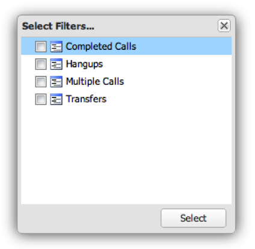
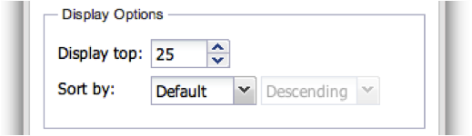

# 設定視覺效果{#configuring-visualizations}

顯示如何設定標題、描述檔、Dimension、量度、篩選、顯示頂端、排序依據和時段。

控制面板畫布上的每個視覺化都有其專屬的設定。 當視覺化首次新增至控制面板畫布時，其設定視窗會自動出現。 設定好後，您隨時都可以按一下視覺化視窗右上角的齒輪圖示來修改視覺化。

>[!NOTE]
>
>設定選項會隨顯示的視覺化類型而略有不同。

## 視覺化標題{#section-0414844283d745ae912e85f8ea14a51d}

此欄位可讓您自訂顯示在視覺化頂端的標題。 依預設，標題會設為&#x200B;**[!UICONTROL Automatic Title]**，這會自動產生視覺化視窗的標題。 清除&#x200B;**[!UICONTROL Automatic Title]**&#x200B;按鈕後，您就可以在此欄位中放置任何標題。 （此欄位適用於所有視覺化。）

## 設定檔 {#section-16eb0def0a2d4eb289f5bb9200d14754}

此欄位可讓您選取要視覺化資料的描述檔。 按一下下拉式功能表，將提供您可存取的描述檔清單。 （此欄位不適用於Rich Text視覺化。）

描述檔是在資料工作台中定義的資料集，包含特定網域的資料，以及資料附帶的維度、量度和篩選。 描述檔通常是為達到特定目的而設計（例如行銷或網站流量）。

>[!NOTE]
>
>您只能看到已授予存取權的設定檔。 如需詳細資訊，請參閱存取控制。

## 維度 {#section-4ebb8c4308a146c3a35c7ac7ab6b579f}

可讓您選取想要視覺化的維度。 清單會從「描述檔」欄位中選取之描述檔的可用維度清單中填入。 按一下所要的維度，然後按一下「選取」按鈕。 （此欄位不適用於「量度圖例」和「豐富文字」視覺化。）

Dimension是類似資料類型的類別。 例如，「周中的天數」維度由下列資料元素組成：週日、星期一、星期二、星期三、星期四、星期五和星期六。 Dimension顯示了所測量的內容。

## 量度{#section-7d46f2f1b9fe4e539b5eb0a0dc6e5ad3}

可讓您選取要視覺化的量度。 量度是量化物件，由一些可量化的運算式定義。 例如，「每個作業的頁面檢視次數」是從「頁面檢視次數」的運算式除以「作業次數」的運算式衍生而來。 量度可回答「多少？」問題

單一度量視覺化具有單一度量選擇視窗：

多度量視覺化具有多度量選擇視窗：

清單會從「描述檔」欄位中選取之描述檔的可用度量清單中填入。

按一下所需的量度，然後按一下&#x200B;**[!UICONTROL Select]**。 （此欄位不適用於Rich Text視覺化。）

## 篩選器 {#section-f8619ae2f8e54735a2c1b0fbb8bb1281}

選取您要套用至視覺化的篩選器。 篩選器選擇窗口允許您從篩選器清單中選擇多個篩選器。 清單會從「描述檔」欄位中選取之描述檔的可用篩選清單填入。 按一下所要的篩選，然後按一下&#x200B;**[!UICONTROL Select]**。

>[!NOTE]
>
>此處套用的篩選器僅會套用至其對應的視覺化，而非整個控制面板。 這對於比較套用不同濾鏡的兩種不同視覺效果的結果非常有用。

## 顯示頂部{#section-7ce71cb0fa6446998b710b427e68b133}

儀表板中的視覺化並非用來顯示整個資料。 相反地，它們可讓您指定要在視覺化中顯示的維度記錄數目。 這會根據下面提供的排序依據值，顯示最多維度數。 （此欄位不適用於表格、量度圖例和Rich Text視覺化。）

## 排序依據{#section-f686249e20444359bff87c00cc2ba29f}

這可讓您指定當資料顯示在視覺化中時，應如何排序資料。 （此欄位不適用於表格、量度圖例和Rich Text視覺化。） 有多種排序選項：

* **[!UICONTROL Default]** -根據資料工作台中儲存的排序順序，傳回未排序的資料。此選項可用於以時間為基礎的資料，例如小時、日、周或月。
* **[!UICONTROL Dimension]** -根據字母數字維值對資料排序。
* **[!UICONTROL Metric]** -根據量度值排序資料，有助於快速視覺化頂層維度。
* **[!UICONTROL Descending]** -以遞減順序排序資料。
* **[!UICONTROL Ascending]** -以遞增順序排序資料。

## 時段 {#section-6220368e9e524b46ac735add6ab9edb0}

此視覺化可讓您指定要在視覺化中顯示的資料開始和／或結束日期。

選取**[!UICONTROL All Dates]**會顯示描述檔中可用的整個日期範圍。

選擇&#x200B;**[!UICONTROL Range]**&#x200B;只顯示指定範圍內的資料。 要輸入日期範圍，您可以鍵入開始和／或結束日期，或通過選擇日曆表徵圖使用日曆輸入。

（此欄位不適用於Rich Text視覺化。）

>[!NOTE]
>
>此處套用的日期範圍僅會套用至其對應的視覺化，而非整個控制面板。 這對於比較套用不同日期範圍的兩個不同視覺化結果非常有用。

