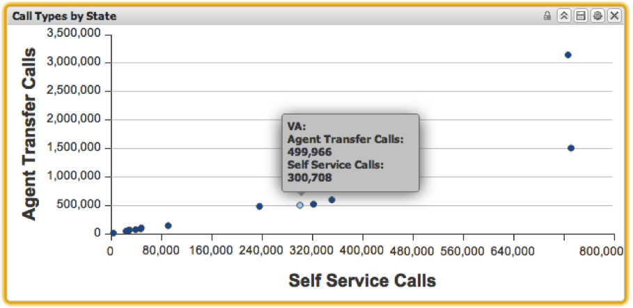

# 散佈圖{#scatter-plot}

散布圖視覺化可讓您針對維度視覺化兩個量度，每個資料元素都以x-y軸上的點表示。 散布圖可讓最多200個獨特的資料元素一次顯示在圖表上。 第一個量度的增量會沿y軸標示，而第二個量度的增量則會沿x軸標示。 將滑鼠置於折線圖中的某個點上，將會在該點顯示確切值。

您可以按一下特定點，在散布圖中進行選取。 按住鍵將保 **[!UICONTROL Alt]** 留選取範圍，同時按一下其他項目。 按一下時按住 **[!UICONTROL Alt]** 鍵也將切換選取範圍的值。 這對於從一組已選取的項目中僅移除一個選取範圍非常有用。

