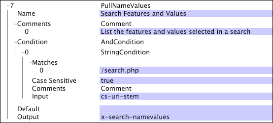

# PullNameValues{#pullnamevalues}

PullNameValues轉換是一種特殊操作，它採用cs-uri-query欄位中的值，並將每個名稱——值對分隔成單獨的字串。

在指定的輸出欄位中，會將整個name-value對字串集合輸出為字串的向量。

| 參數 | 說明 | 預設 |
|---|---|---|
| 名稱 | 轉換的描述性名稱。 您可以在此輸入任何名稱。 |  |
| 註解 | 選填。關於轉變的附註。 |  |
| 條件 | 應用此轉換的條件。 |  |
| 預設 | 如果條件符合且輸入值在給定日誌條目中不可用，則使用的預設值。 |  |
| 輸出 | 輸出字串的名稱。 |  |

此範例中使用[!DNL PullNameValues]轉換來擷取訪客對搜尋表單的使用：選取了哪些按鈕、在表單中輸入了哪些值等。 此範例使用[!DNL String Match]條件（請參閱[Conditions](../../../../../home/c-dataset-const-proc/c-conditions/c-abt-cond.md)）將此轉換的使用區隔為僅使用頁面[!DNL /search.php]。 名稱值對的向量會輸出到欄位x-search-namevalues。

使用上述定義的轉換，如果cs-uri-stem欄位符合頁面[!DNL /search.php]和cs-uri-query包含下列項目：

* Searchfor=Bob&amp;State=Virginia&amp;isMale=true

然後x-search-namevalues將包含包含下列三個字串的向量：

* Searchfor=Bob
* 州=維吉尼亞
* isMale=true
