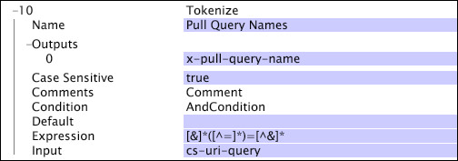

# Tokenize{#tokenize}

Tokenize變換反覆地對輸入字串應用規則運算式。

但與之不同 [!DNL RETransform]的是， [!DNL Tokenize] 不必符合整個字串：用於轉換的規則運算式 [!DNL Tokenize] 可以匹配輸入的子集。 找到匹配後，請 [!DNL Tokenize] 再次應用規則運算式，從上次匹配結束後的字元開始。

| 參數 | 說明 | 預設值 |
|---|---|---|
| 名稱 | 轉換的描述性名稱。 您可以在此輸入任何名稱。 |  |
| 區分大小寫 | 是非。 指定匹配是否區分大小寫。 |  |
| 意見 | 選填。關於轉變的附註。 |  |
| 條件 | 應用此轉換的條件。 |  |
| 預設值 | 如果條件符合且輸入值不可用或規則運算式不符合輸入值，則使用的預設值。 |  |
| 運算式 | 用於匹配的規則運算式。 |  |
| 輸出 | 輸出字串的名稱。 您可針對指定的輸入字串提供多個輸出。 輸出數必須與規則運算式中擷取子模式的數目相對應。 |  |

在下例中，轉 [!DNL Tokenize] 換使用規則運算式來捕獲查詢字串的名稱（在cs-uri-query中），並將捕獲的子模式（查詢名稱）輸出為x-pull-query-name。

對於查詢字串&quot;a=b&amp;c=d&quot;，輸出會是包含&quot;a&quot;和&quot;c&quot;的向量。

如需規則運算式的詳細資訊，請參 [閱規則運算式](../../../../../home/c-dataset-const-proc/c-reg-exp.md#concept-070077baa419475094ef0469e92c5b9c)。
