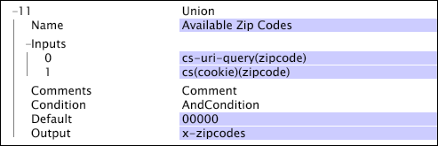

# 聯合{#union}

聯合轉換採用一組輸入，並建立字串向量作為輸出。

如果其中一個輸入本身是向量，則輸入向量中的每個元素與輸出向量中的一個元素相關聯（即，變換不建立向量的向量）。

| 參數 | 說明 | 預設 |
|---|---|---|
| 名稱 | 轉換的描述性名稱。 您可以在此輸入任何名稱。 |  |
| 註解 | 選填。轉換的相關附註。 |  |
| 條件 | 套用此轉換的條件。 |  |
| 預設 | 在符合條件且輸入值不可用時使用的預設值。 |  |
| 輸入 | 一個或多個輸入值。 |  |
| 輸出 | 輸出欄位的名稱。 |  |

此範例使用網站流量的資料欄位來建立與網站訪客相關聯的郵遞區號清單（即每個記錄項目內）。 資料提供此資訊的兩個可能來源：一個在cs-uri-query中，另一個在cookie的[!DNL zipcode]欄位中。 如果這些欄位均不包含郵遞區號，則會使用00000的預設值。

雖然這兩個值都可以在單個日誌條目中使用，但您可以根據轉換的輸出選擇建立維時要使用的值。 在一般使用案例中，您會建立簡單維度，取用所遇到值的第一個或最後一個。 有關建立簡單維的資訊，請參閱[擴展Dimension](../../../../../home/c-dataset-const-proc/c-ex-dim/c-abt-ex-dim.md)。
