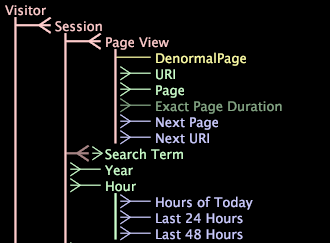

# 資料集結構{#dataset-schema}

「資料集結構」介面會顯示任何「轉換資料集設定」檔案中定義的擴充維度（可計數、簡單、多對多、數值、非正規和時間維度），以及這些維度之間的關係。

此外，[!DNL Dataset Schema]介面還顯示您定義的任何派生維，以及配置為隱藏的任何擴展維。

本節討論以下主題：

* [要使用資料集模式介面解譯維類型](../../../../home/c-dataset-const-proc/c-dataset-config-tools/c-dataset-config-int/c-dataset-schema.md#section-16a0a12b11334c07bec558c0b7d260b1)
* [顯示維度的預設視覺化](../../../../home/c-dataset-const-proc/c-dataset-config-tools/c-dataset-config-int/c-dataset-schema.md#section-1bbb73a5cbb34ffb844eb1932db85318)
* [顯示維度的特定視覺化](../../../../home/c-dataset-const-proc/c-dataset-config-tools/c-dataset-config-int/c-dataset-schema.md#section-d46626df90bc4c44ae60c4b71eaeac7f)

## 使用資料集模式介面{#section-16a0a12b11334c07bec558c0b7d260b1}解譯Dimension類型

下表列出了尺寸類型及其名稱在[!DNL Dataset Schema]介面中顯示的顏色。 另外，也會記下範例尺寸的父項（來自上述範例）。

<table id="table_20D1A9EAAED247338476C475C63255F5"> 
 <thead> 
  <tr> 
   <th colname="col1" class="entry"> Dimension類型 </th> 
   <th colname="col2" class="entry"> 色彩 </th> 
   <th colname="col3" class="entry"> 範例Dimension與父項 </th> 
  </tr> 
 </thead>
 <tbody> 
  <tr> 
   <td colname="col1"> 可計數 </td> 
   <td colname="col2"> 粉紅色 </td> 
   <td colname="col3"> 
訪客——在此結構中，訪客是根可計數維。 
 
 作業階段——父代為訪客。 
 </td> 
  </tr> 
  <tr> 
   <td colname="col1"> 非正規 </td> 
   <td colname="col2"> 黃色 </td> 
   <td colname="col3"> 非正規頁面——父代為頁面檢視。 </td> 
  </tr> 
  <tr> 
   <td colname="col1"> 衍生 </td> 
   <td colname="col2"> 藍色 </td> 
   <td colname="col3"> 下一頁——父代是頁面檢視。 </td> 
  </tr> 
  <tr> 
   <td colname="col1"> 多對多 </td> 
   <td colname="col2"> 粉紅色和綠色（父項的莖線為粉紅色，而尺寸名稱為綠色）。 </td> 
   <td colname="col3"> 搜尋詞——父代為作業階段。 </td> 
  </tr> 
  <tr> 
   <td colname="col1"> 數值 </td> 
   <td colname="col2"> 綠色 </td> 
   <td colname="col3"> 完全頁面持續時間——父級為頁面檢視在此範例中，完全頁面持續時間是隱藏的數值維度。 請參閱此表中的隱藏維類型。 </td> 
  </tr> 
  <tr> 
   <td colname="col1"> 簡單 </td> 
   <td colname="col2"> 綠色 </td> 
   <td colname="col3"> 頁面——父代是頁面檢視。 </td> 
  </tr> 
  <tr> 
   <td colname="col1"> 時間 </td> 
   <td colname="col2"> 綠色 </td> 
   <td colname="col3"> 小時——父代是會話。 </td> 
  </tr> 
  <tr> 
   <td colname="col1"> 隱藏 </td> 
   <td colname="col2"> 隱藏的尺寸是適當尺寸類型顏色的較深色版本。 例如，隱藏的數值維度是較深、較淺的綠色。 </td> 
   <td colname="col3"> 完全頁面持續時間——父代為頁面檢視。 </td> 
  </tr> 
 </tbody> 
</table>

## 顯示Dimension{#section-1bbb73a5cbb34ffb844eb1932db85318}的預設可視化

* 在[!DNL Dataset Schema]介面中，按一下所需的維度。 顯示預設視覺化。 例如，如果預設視覺化是顯示「作業」和選取維度的表格，而您按一下URI維度，資料工作台會依「作業」顯示具有URI的表格。

>[!NOTE]
>
>如果要更改顯示的預設可視化，請參閱&#x200B;*Data Workbench使用手冊*&#x200B;中的「配置介面和分析功能」一章。

## 顯示Dimension{#section-d46626df90bc4c44ae60c4b71eaeac7f}的特定視覺化

* 在[!DNL Dataset Schema]介面中，以滑鼠右鍵按一下所要的維度，然後按一下&#x200B;**[!UICONTROL Add Visualization]** > ***[!UICONTROL visualization type]**>*。
