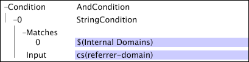

# 向量參數{#vector-parameters}

向量參數包含單一變數的多個值。

您只能參照向量參數作為向量的唯一項目。 此示例顯示一個[!DNL Transformation Dataset Include]檔案，用於定義向量參數。 向量參數「內部網域」包含三個值。

請注意，向量參數是[!DNL String Match]條件中列出的[!DNL Matches]向量的唯一項目。

如需有關內部網域的詳細資訊，請參閱[網站資料的組態設定](../../../../home/c-dataset-const-proc/c-config-web-data/c-config-web-data.md#concept-9a306b65483a484bb3f6f3c1d7e77519)。 有關[!DNL String Match]條件的資訊，請參見[條件](../../../../home/c-dataset-const-proc/c-conditions/c-abt-cond.md)。
