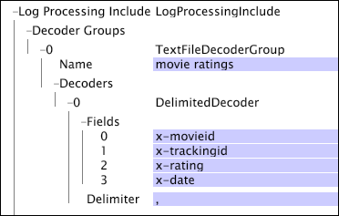

# 文字檔案解碼器群組{#text-file-decoder-groups}

將日誌檔案作為日誌源進行處理需要在日誌處理資料集包含檔案中定義解碼器，以從日誌條目中提取資料欄位。

定義日誌檔案日誌源的文本檔案解碼器組需要對日誌檔案的結構和內容、要提取的資料以及儲存該資料的欄位有所瞭解。 本節提供您可以為解碼器指定之參數的基本說明，但使用任何解碼器的方式取決於包含來源資料的記錄檔。

有關日誌檔案日誌源的格式要求的資訊，請參見[日誌檔案](../../../../../home/c-dataset-const-proc/c-log-proc-config-file/c-log-sources.md#concept-3d4fb817c057447d90f166b1183b461e)。 如需定義文字檔案解碼器的協助，請連絡Adobe。

文字檔案解碼器群組可包括：

* [規則運算式解碼器](../../../../../home/c-dataset-const-proc/c-dataset-inc-files/c-types-dataset-inc-files/c-log-proc-dataset-inc-files/c-text-file-dec-groups.md#section-67aca2c1f008404da7f845a64abec97c)
* [分隔解碼器](../../../../../home/c-dataset-const-proc/c-dataset-inc-files/c-types-dataset-inc-files/c-log-proc-dataset-inc-files/c-text-file-dec-groups.md#section-7e0a23decdbc4c75ae750a42446997a6)

## 規則運算式解碼器{#section-67aca2c1f008404da7f845a64abec97c}

規則表達式解碼器識別日誌檔案中日誌條目內的複雜字串模式，並將這些模式提取為資料欄位。 對於每個解碼器，欄位數必須等於規則運算式中擷取子模式的數目。 匹配第n個捕獲子模式的行的部分被分配給該行的第n個欄位。

**若要將規則運算式解碼器新增至文字檔案解碼器群組**

1. 如[編輯現有資料集包含檔案](../../../../../home/c-dataset-const-proc/c-dataset-inc-files/c-work-dataset-inc-files/t-edit-ex-dataset-inc-files.md#task-456c04e38ebc425fb35677a6bb6aa077)中所述，開啟[!DNL Log Processing Dataset Include]檔案，並新增文字檔案解碼器群組。 請參閱表條目[解碼器組](../../../../../home/c-dataset-const-proc/c-dataset-inc-files/c-types-dataset-inc-files/c-log-proc-dataset-inc-files/c-log-proc-dataset-inc-files.md#concept-999475a22519432e98844622ca95b6ab)。

1. 在新建立的解碼器群組下按一下右鍵，然後按一下&#x200B;**[!UICONTROL Add new]** > **[!UICONTROL Regular Expression]**。**[!UICONTROL Decoders]**

1. 指定下列資訊：

   * **欄位：** 記錄檔中欄位的清單。如果要將此處定義的任何欄位傳遞到資料集構建的轉換階段，則必須將這些欄位列在資料集[!DNL Log Processing Dataset Include]檔案之一的「欄位」參數中。 自訂欄位名稱必須以&quot;x-&quot;開頭。

   * **名稱：解** 碼器的選用識別碼。
   * **規則運算式：** 用於從檔案的每一行擷取所需的欄位。

1. 對要添加到組的任何其他解碼器重複步驟4和5。
1. 要保存[!DNL Log Processing Dataset Include]檔案，請按一下右鍵窗口頂部的&#x200B;**[!UICONTROL (modified)]** ，然後按一下&#x200B;**[!UICONTROL Save]**。

1. 要使本地更改生效，請在[!DNL Profile Manager]中按一下右鍵[!DNL User]列中檔案的複選標籤。 按一下&#x200B;**[!UICONTROL Save to]** > *&lt;**[!UICONTROL profile name]**>*，其中配置檔案名稱是資料集配置檔案的名稱或資料集包含檔案所屬的繼承配置檔案的名稱。

請勿將修改過的配置檔案保存到Adobe提供的任何內部配置檔案中，因為安裝這些配置檔案的更新時將覆蓋您所做的更改。

>[!NOTE]
>
>給定日誌檔案可以具有多個規則運算式解碼器。 定義解碼器的順序很重要：比對記錄檔中一行的第一解碼器是用來解碼該行的解碼器。

此範例說明如何使用規則運算式解碼器，從Tab分隔的文字檔案擷取資料欄位。 您可以定義具有制表符分隔字元的分隔字元解碼器，以取得相同的結果。

如需規則運算式解碼器的詳細資訊，包括術語和語法，請參閱[規則運算式](../../../../../home/c-dataset-const-proc/c-reg-exp.md#concept-070077baa419475094ef0469e92c5b9c)。

## 分隔解碼器{#section-7e0a23decdbc4c75ae750a42446997a6}

分隔解碼器解碼日誌檔案，該日誌檔案的欄位由單個字元分隔。 欄數必須與分隔檔案的欄數相對應；不過，並非所有欄位都需要命名。 如果欄位留空，記錄檔中仍需要欄位，但解碼器會忽略欄位。

**向文本檔案解碼器組添加分隔的解碼器**

1. 如[編輯現有資料集包含檔案](../../../../../home/c-dataset-const-proc/c-dataset-inc-files/c-work-dataset-inc-files/t-edit-ex-dataset-inc-files.md#task-456c04e38ebc425fb35677a6bb6aa077)中所述，開啟[!DNL Log Processing Dataset Include]檔案，並新增文字檔案解碼器群組。 請參閱表條目[解碼器組](../../../../../home/c-dataset-const-proc/c-dataset-inc-files/c-types-dataset-inc-files/c-log-proc-dataset-inc-files/c-log-proc-dataset-inc-files.md#concept-999475a22519432e98844622ca95b6ab)。

1. 在新建立的解碼器群組下按一下右鍵，然後按一下&#x200B;**[!UICONTROL Add new]** > **[!UICONTROL Delimited]**。**[!UICONTROL Decoders]**

1. 指定下列資訊：

   * **欄位：** 記錄檔中欄位的清單。如果要將此處定義的任何欄位傳遞到資料集構建的轉換階段，則必須將這些欄位列在資料集[!DNL Log Processing Dataset Include]檔案之一的「欄位」參數中。 自訂欄位名稱必須以&quot;x-&quot;開頭。

   * **分隔字** 元：用來分隔輸出檔案中欄位的字元。

1. 對要添加到組的任何其他解碼器重複步驟4和5。
1. 要保存[!DNL Log Processing Dataset Include]檔案，請按一下右鍵窗口頂部的&#x200B;**[!UICONTROL (modified)]** ，然後按一下&#x200B;**[!UICONTROL Save]**。

1. 要使本地更改生效，請在[!DNL Profile Manager]中按一下右鍵[!DNL User]列中檔案的複選標籤，然後按一下&#x200B;**[!UICONTROL Save to]** > ***[!UICONTROL profile name]**>* ，其中配置檔案名稱是資料集配置檔案的名稱或資料集包含檔案所屬的繼承配置檔案。

>[!NOTE]
>
>請勿將修改過的配置檔案保存到Adobe提供的任何內部配置檔案中，因為安裝這些配置檔案的更新時將覆蓋您所做的更改。

此範例說明如何使用分隔字元解碼器從包含影片相關資料的逗號分隔文字檔案擷取資料欄位。

