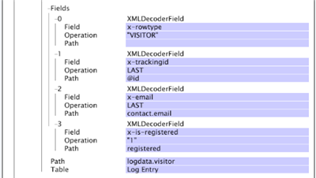

# XML 解碼器群組{#xml-decoder-groups}

將XML檔案作為日誌源進行處理，以定義用於從XML檔案中提取資料的解碼器。

>[!NOTE]
>
>為XML日誌源定義XML解碼器組需要瞭解XML檔案的結構和內容、要提取的資料以及儲存該資料的欄位。 本節提供您可以為解碼器指定的參數的基本說明。 您使用任何解碼器的方式取決於包含來源資料的XML檔案。

有關XML日誌源的格式要求的資訊，請參見[ Log Sources](../../../../../home/c-dataset-const-proc/c-log-proc-config-file/c-log-sources.md#concept-6714c720fac044cbb9af003bf401b2ea)。 如需定義XML解碼器的協助，請連絡Adobe。

XML解碼器的頂層是解碼器群組(XMLDecoderGroup)，它是一組解碼器表，用於從特定格式的XML檔案擷取資料。 如果您有不同格式的XML檔案，則必須為每個格式定義解碼器群組。 每個解碼器組由一個或多個解碼器表組成。

下表說明了Tables參數以及您必須指定以定義XML解碼器群組的所有子參數。

<table id="table_06C40C5149E94548A1B0C2ED4397624B"> 
 <thead> 
  <tr> 
   <th colname="col1" class="entry"> 參數 </th> 
   <th colname="col2" class="entry"> 說明 </th> 
  </tr> 
 </thead>
 <tbody> 
  <tr> 
   <td colname="col1"> 表格 </td> 
   <td colname="col2"> <p>解碼器組中的每個表代表要從XML檔案中提取的一級資料。 例如，如果您想要擷取有關訪客的資料，則您會建立解碼器表格，其中包含您要為每位訪客擷取的資訊。 您也可以在解碼器表內建立解碼器表（請參閱子系）。 </p> <p> <b>若要新增表格至解碼器群組</b> 
     <ul id="ul_C73CAD77440B4465B9FCE08BF4FA0749"> 
      <li id="li_C4B8CC5A85D942898F1EB76778105818"> 按一下右鍵<span class="uicontrol">表</span> ，然後按一下<span class="uicontrol">添加新</span> &gt; <span class="uicontrol"> XMLDecoderTable </span>。 </li> 
     </ul> </p> </td> 
  </tr> 
  <tr> 
   <td colname="col1"> 欄位 </td> 
   <td colname="col2"> <p>儲存資料的延伸欄位（例如x-trackingid、x-email）。 要儲存在欄位中的資料由路徑和／或操作子欄位確定。 </p> <p> 路徑是結構化XML檔案中欄位的層級。 欄位的路徑相對於定義該欄位的表的路徑。 範例包括<span class="filepath"> tag.tag.tag </span>或<span class="filepath"> tag.tag.tag。@attribute </span>。 請注意，路徑區分大小寫。 </p> <p> 「操作」(Operation)應用於指定路徑中的每行，以生成輸出。 可使用下列操作： 
     <ul id="ul_B264A411D7E3446288E7E69D62150B8B"> 
      <li id="li_5936E81C0EEF46AFB780E451A04A88E4"><b>LAST:</b> 此欄位會取用XML檔案中路徑上一次出現的值。 </li> 
      <li id="li_7BC4F24F2CA84C2EB64B06FE09B4CAF6"><b>RANDOM：為</b> 欄位指派隨機值。如果您需要產生唯一ID，例如x-trackingid欄位，此操作會很有用。 </li> 
      <li id="li_C1D34EA11BFB4859A25A275A9B63FB56"><b>INHERIT：定</b> 義的欄位會從父表的相應欄位繼承其值。 </li> 
      <li id="li_F62FB8CD962E4E1495D9A2D5B7A78E2A"><b>"<i>常 </i>數":</b> 常數必須括在引號中。可以使用常數操作來檢查是否存在特定路徑；如果路徑存在，則為欄位分配常數的值。 </li> 
     </ul> </p> <p> <b>若要新增欄位至解碼器表格</b> </p> <p> 
     <ul id="ul_91D104D927424DEA9E788E43B2F6FEA9"> 
      <li id="li_5448B01EE82349569BBFC99C9604D7B8"> 按一下右鍵<span class="uicontrol">欄位</span> ，然後按一下<span class="uicontrol">添加新</span> &gt; <span class="uicontrol"> XMLDecoderField </span>。 根據需要定義欄位、工序和路徑。 </li> 
     </ul> </p> </td> 
  </tr> 
  <tr> 
   <td colname="col1"> 路徑 </td> 
   <td colname="col2"> <p>解碼器表包含資訊的結構化XML檔案內的級別。 對於子XML解碼器表，路徑相對於父表的路徑。 請注意，路徑區分大小寫。 </p> <p> 例如，如果XML檔案包含結構： </p> 

    &amp;lt;visitor&amp;gt;
    
    &amp;nbsp;
    
    ...
    
    &amp;nbsp; 
    
    &amp;lt;/visitor&amp;gt;
    
    &amp;lt;/logdata&amp;gt;&amp;nbsp;   &lt;p> 則路徑為&lt;span class=&quot;filepath&quot;>logdata.visitor&lt;/span>。&lt;/p> &lt;/td>
</tr> 
  <tr> 
   <td colname="col1"> 表格 </td> 
   <td colname="col2"> <p>此參數的值應一律為「記錄項目」。 </p> <p> <p>注意： 不要在未諮詢Adobe的情況下更改此值。 </p> </p> </td> 
  </tr> 
  <tr> 
   <td colname="col1"> 兒童 </td> 
   <td colname="col2"> <p>選填。一個或多個嵌入的解碼器表。 每個子項都包括上述的欄位、路徑和表參數。 </p> <p> <b>若要將子系新增至解碼器表</b> </p> <p> 
     <ul id="ul_902AC6CA5D66457D84CBA3194FF49BBE"> 
      <li id="li_07B4D60E7E2E4630B4878691E575936A"> 按一下右鍵<span class="uicontrol">子項</span> ，然後按一下<span class="uicontrol">添加新</span> &gt; <span class="uicontrol"> XMLDecoderTable </span>。 根據需要定義欄位、工序和路徑。 </li> 
     </ul> </p> </td> 
  </tr> 
 </tbody> 
</table>

若要將XML檔案用作資料集的記錄來源，必須定義XML解碼器群組和表格，以擷取要處理至資料集的資訊。 在此範例中，您可以瞭解如何為Web資料集的範例XML記錄檔來源定義解碼器群組和表格。

下列XML檔案包含網站訪客的相關資訊，包括Experience CloudID、電子郵件地址、實體位址，以及訪客頁面檢視的相關資訊。


由於我們有單一XML檔案，所以只需要一個解碼器群組，我們稱之為「範例XML格式」。 此解碼器組適用於與此檔案格式相同的任何其他XML檔案。 要開始在此解碼器組內構建XML解碼器表，首先必須確定要提取哪些資訊以及要儲存資料的欄位。

在此範例中，我們會擷取有關該訪客的資訊以及與該訪客關聯的頁面檢視。 為此，我們建立頂層（父）XML解碼器表格，其中包含訪客的相關資訊，以及內嵌（子）XML解碼器表格，其中包含該訪客的頁面檢視相關資訊。

**上層（訪客）表格的資訊如下**

* XML檔案中每一列資料的資料類型識別碼。 我們使用VISITOR做為識別碼，以便快速識別與訪客相關的資料列，而非頁面檢視。 我們可將此值儲存在x-rowtype欄位中。
* 訪客的ID，我們儲存在x-trackingid欄位中。
* 訪客的電子郵件地址(contact.email)，我們將其儲存在x-email欄位中。
* 訪客的註冊狀態。 如果訪客是已註冊的使用者，我們可將值&quot;1&quot;儲存在x-is-registered欄位中。
* 路徑值為[!DNL logdata.visitor]，表值為[!DNL Log Entry]。 有關這些參數的資訊，請參見上面的XMLDecoderGroup表。

**子（頁面檢視）表格的資訊如下：**

* XML檔案中每一列資料的資料類型識別碼。 我們使用&quot;PAGEVIEW&quot;做為識別碼，以便快速識別與訪客的頁面檢視相關的資料列，而非僅與訪客相關的資料列。 我們將此值儲存在x-rowtype欄位中。
* 訪客的ID。 此值繼承自父表格，並儲存在x-trackingid欄位中。
* 每個頁面檢視的時間戳記，會儲存在x-event-time欄位中。
* 每個頁面檢視的URI，會儲存在cs-uri-stem欄位中。
* 路徑值為pageview，表值為「記錄項目」。 有關這些參數的資訊，請參見上面的XMLDecoderGroup表。

以下螢幕截圖顯示了基於所討論的父XML解碼器表和子XML解碼器表的結構，為示例XML檔案生成的XML解碼器組的[!DNL Log Processing Dataset Include]檔案的一部分。




顯示此解碼器輸出之範例XML檔案的表格如下：

| x-rowtype | cs-uri-stem | x-email | x-is-registered | x-event-time | x-tracking-id |
|---|---|---|---|---|---|
| 訪客 |  | foo@bar.com | 1 |  | 1 |
| PAGEVIEW | /index.html |  |  | 2006-01-01 08:00:00 | 1 |
| PAGEVIEW | / |  |  | 2006-01-01 08:00:30 | 3 |

您可以使用欄位檢視器介面，在資料工作台中建立類似上述表格的表格。 如需欄位檢視器介面的詳細資訊，請參閱[資料集設定工具](../../../../../home/c-dataset-const-proc/c-dataset-config-tools/c-dataset-config-tools.md#concept-6e058b7691834cf79dcfd1573f78d4f5)。

## 使用XML元素上的#value讀取其屬性值{#section-88758428afb94f0baa5a986604d53bc1}

您現在可以在XML路徑中使用&#x200B;**[!DNL #value]**&#x200B;標籤來提取XML元素的值。

例如，先前指定的路徑&#x200B;**`<Hit><Page name="Home Page" index="20">home.html</Page></Hit>`**&#x200B;讓您無法讀取`<Page>`標籤的值。 若要讀取`<Page>`標籤的值及其屬性，可以分別使用[!DNL Hit.Page.@name]和[!DNL Hit.Page.@index]。 您也可以使用&#x200B;**`Hit.Page.#value`**&#x200B;運算式提取標籤的值。

例如，您可以在解碼器中新增下列欄位，讀取標籤`<varValue>`的值：

```
7 = XMLDecoderField: 
Field = string: x-varvalue-name-added 
Operation = string: LAST 
Path = string:  
<b>#value</b> 
Path = string: varValue 
Table = string: Log Entry
```

同樣地，您可以在解碼器中新增下列欄位，以讀取標籤`<Rep>`的值：

```
7 = XMLDecoderField: 
Field = string: x-rep-name-added 
Operation = string: LAST 
Path = string: Rep.# 
<b>value</b> 
Path = string: Reps 
Table = string: Log Entry
```

相反地，若要讀取無屬性的元素標籤值，`<line>`標籤下方的`<text>`標籤及其值可直接透過在路徑中指定&quot; [!DNL text]&quot;或使用[!DNL line.text]來讀取，視您建立解碼器的方式而定。

```
2 = XMLDecoderField: 
Field = string: x-chat-text 
Operation = string: LAST 
Path = string:  
<b>text</b> 
Path = string:  
<b>line</b> 
Table = string: Log Entry
```
