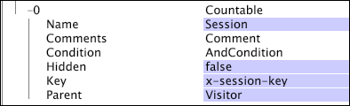

# 可數維度{#countable-dimensions}

{{eol}}

系統可以計算可數維度的元素。

可數維度通常用來建立總和量度，以傳回維度所有元素的計數或總和。 您可以定義可數維度，以計算例項，例如訂房預訂或產品訂單。 例如，您可以定義可數維度「訂單」，其元素（與來自線上商店的訂單相對應的記錄項目）可被計算。 如果您想在視覺效果中顯示訂單計數，可定義「訂單總和」量度，此量度可透過維度評估，或套用篩選器。

可計數維度可以是其他維度的父項，或是其他可計數維度的子項。

>[!NOTE]
>
>如果您需要的維度只提供某個項目的計數，則應使用數值維度搭配COUNT操作。 請參閱 [數值Dimension](../../../../home/c-dataset-const-proc/c-ex-dim/c-types-ex-dim/c-num-dim.md#concept-8513b9afaff447c8b334410b565b91ed).

可數維度由下列參數定義：

<table id="table_9F3F093F5B074EA68CA4DCE731161F6C"> 
 <thead> 
  <tr> 
   <th colname="col1" class="entry"> 參數 </th> 
   <th colname="col2" class="entry"> 說明 </th> 
   <th colname="col3" class="entry"> 預設 </th> 
  </tr> 
 </thead>
 <tbody> 
  <tr> 
   <td colname="col1"> 名稱 </td> 
   <td colname="col2"> Data Workbench中使用者看到的維度描述性名稱。 維度名稱不能包含連字型大小(-)。 </td> 
   <td colname="col3"> </td> 
  </tr> 
  <tr> 
   <td colname="col1"> 註解 </td> 
   <td colname="col2"> 選填。延伸維度的相關附註。 </td> 
   <td colname="col3"> </td> 
  </tr> 
  <tr> 
   <td colname="col1"> 條件 </td> 
   <td colname="col2"> 輸入欄位有助於建立可數維度的條件。 若已指定，條件會限制維度所可見的記錄項目集，以及資料集結構中其所有子項。 </td> 
   <td colname="col3"> </td> 
  </tr> 
  <tr> 
   <td colname="col1"> 隱藏 </td> 
   <td colname="col2"> 判斷維度是否顯示在Data Workbench介面中。 此參數預設會設為false。 例如，如果維度僅作為量度的基礎，您可以將此參數設為true，以便在Data Workbench顯示中隱藏維度。 </td> 
   <td colname="col3"> false </td> 
  </tr> 
  <tr> 
   <td colname="col1"> 金鑰 </td> 
   <td colname="col2"> 
選填。要作為索引鍵的欄位名稱。 如果您定義此參數，可數維度的父元素與指定為索引鍵之欄位的不同值的每種組合，都會存在可數維度的元素。 
 
 可數維度的每個元素都需要與一組連續的記錄項目相關。 因此，如果日誌條目不是按鍵排序的，則每次鍵欄位更改時都會建立可數維的元素。 為避免此情況，Adobe建議您使用按時間順序連續的唯一金鑰。 
 </td> 
   <td colname="col3"> </td> 
  </tr> 
  <tr> 
   <td colname="col1"> 父級 </td> 
   <td colname="col2"> 
父維的名稱。 任何可計數維度都可以是父維度。 若要將維度設為資料集結構中的頂層維度，請將參數設為「root」。 定義的維度會成為資料集的根可數維度。 例如，如果您使用的是網站，訪客維度是資料集的根可數維度。 
 
 
注意：雖然您的根可數維度不必與資料中的追蹤ID相關聯，但Adobe建議您設定資料集的根可數維度，以使用追蹤ID欄位(x-trackingid)作為其索引鍵。 因此，根可數的每個元素都與x-trackingid的唯一值相關聯，而每個元素的所有資料都會分組在一起。 如果您想要以不同方式設定資料集，請聯絡Adobe。 
 
 </td> 
   <td colname="col3"> </td> 
  </tr> 
 </tbody> 
</table>

此範例說明可數維度的定義，使用從網站流量收集的事件資料。 可數維度會計算指定工作階段內的Web促銷活動事件。 假設是，所有電子郵件促銷活動資源都是從Web伺服器請求，而cs-uri-query中包含&quot;email=&quot;。 在此範例中，訪客在指定工作階段期間回應電子郵件促銷活動的次數很受關注，而非cs-uri-query(email)欄位的實際值。

此範例也說明可數維度的定義，使用從網站流量收集的事件資料，但有已定義的索引鍵參數。 「工作階段可數」維度以x-session-key欄位作為索引鍵。 (x-session-key欄位是 [!DNL Sessionize] 轉換，且每個工作階段的值都不重複。) 訪客維度（父項）的元素與x-session-key欄位的每個唯一組合，都是工作階段維度的元素。

