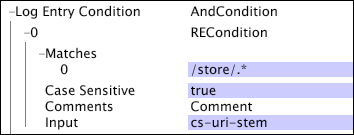

# 日誌處理參數{#log-processing-parameters}

連結至Log Processing.cfg檔案中特定參數的其他資訊。

<!--
c_data_filters.xml
-->

## 資料篩選器 {#data-filters}

在檔案中定義的篩 [!DNL Log Processing.cfg] 選器包括：

* 結束時間
* 雜湊閾值
* 開始時間

由這些參數定義的過濾發生在日誌條目離開解碼器之後和轉換之後，但在由評估之前 [!DNL Log Entry Condition]。 一般而言，變更這些參數會變更資料集的組成。

建議使用資料 [!DNL Sensor] 來源來建立涵蓋特定時段的資料集的技巧是使用資料集的「開始時間」和「結束時間」參數。

使用「開始時間」和「結束時間」參數是其他技術的首選方法，例如移動日誌檔案以按目錄分隔它們。 透過設定資料集的開始和結束時間，資料工作台伺服器會自動僅使用在指定時間間隔內發生的記錄項目。 假設「結束時間」已過去，資料工作台伺服器通常會使用相同的記錄項目集來更新資料集，即使資料集是透過新增轉換來更新。

<!--
c_log_entry_con.xml
-->

## 記錄項目

實際上，它是對可用日誌條目的篩選過程。 如果 [!DNL Log Entry Condition] 返回值為false，則從可用日誌條目集中過濾日誌條目。

通 [!DNL Log Entry Condition] 過使用條件操作(請參閱 [Conditions](../../../home/c-dataset-const-proc/c-conditions/c-abt-cond.md))來說明，並可使用由收集的任何輸入欄位 [!DNL Sensor] (請參閱 *Workbench[!DNL Sensor]*[!DNL Log Processing.cfg] Guide)或通過檔案中包含的轉換生成的任何擴展欄位來定義測試條件。 [!DNL Log Entry] 條件會在記錄處理期間套用，也可在轉換期間套用。

此範例說明如何使用網 [!DNL log entry condition] 站資料。 您可以使用來 [!DNL Log Entry Condition] 建立資料集，以集中在網站的特定部分或在網站上執行特定動作的訪客。

在本 [!DNL Log Entry Condition] 範例中，會建立資料集，其中僅包含屬於網站商店的記錄項目。 將匹配模 [!DNL RECondition test] 式和欄位用 [!DNL "/store/.*"] 作 [!DNL cs-uri-stem] 規則運算式的輸入，資料集中只會包含以字串開頭的 [!DNL "/store/"] 網頁。

<!--
c_key_split.xml
-->

## 密鑰分割 {#key-split}

資料集中的跟蹤ID數量人為增加，但資料工作台伺服器處理的日誌條目總數沒有人為增加，從而保留了資料集中可計數事件總數。 分割單一元素的資料後，資料會永遠與兩個不同的追蹤ID關聯，因此無法關聯。

例如，如果您使用的是Web資料，則每個追蹤ID代表一個獨特訪客。 如果您啟用金鑰分割，資料集中含有大量事件資料的訪客會分割為多個訪客。 雖然資料集中的訪客數量會人為增加，但可計數的事件（例如頁面檢視或預訂）總數不會人為增加。 發生分割後，子訪客的資料便無法關聯。

密鑰分割使用概率算法。 因此，在記憶體使用量、失敗概率、密鑰分割閾值( [!DNL Split Key Bytes])和資料集大小之間會有折中。 使用建議的設定（如下所列），失敗率很低。 在事件資料超過關鍵分割臨界值的元素中，約1/22,000（通常低於1個資料集）會截斷其部分資料，而非分割。

下表顯示每個參數的建議值（無索引鍵拆分和帶索引鍵拆分）。

| 參數 | 無密鑰拆分 | 密鑰拆分 |
|---|---|---|
| 組最大密鑰位元組數 | 1e6 | 2e6 |
| 分割關鍵時段空間 | 6e6 | 6e6 |
| 拆分鍵位元組 | 0 | 1e6 |
| 拆分鍵空間比 | 10 | 10 |

[!DNL Group Maximum Key Bytes] 指定可針對單一追蹤ID處理的事件資料量上限。 從資料集建構程式中篩選超過此限制的資料。 [!DNL Split Key Bytes] 代表將單一追蹤ID分割為多個元素的位元組數。 根據概率分佈，以大約這個數位元組來拆分元素。 [!DNL Split Key Space Ratio] 並控 [!DNL Split Key Bucket Space] 制密鑰拆分的記憶體利用率和故障率。

>[!NOTE]
>
>[!DNL Group Maximum Key Bytes]、 [!DNL Split Key Bytes]、 [!DNL Split Key Space Ratio]和 [!DNL Split Key Bucket Space] all必須聲明，密鑰拆分才能正常工作。 請勿在未諮詢Adobe的情況下變更這些參數的值。

