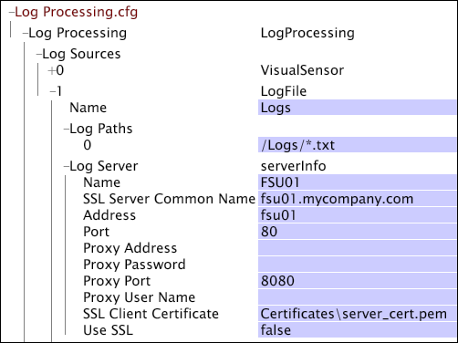
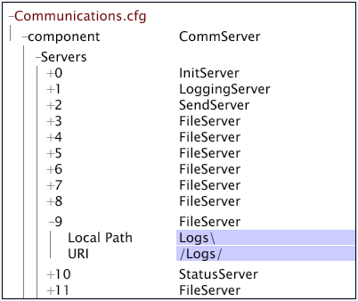
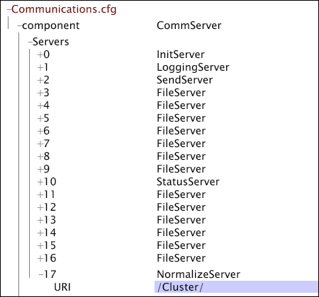

# 配置資料工作台伺服器檔案伺服器單元{#configuring-a-data-workbench-server-file-server-unit}

有關Insight Server檔案伺服器單位和檔案伺服器設定程式的資訊。

<!--
c_abt_file_svr_units.xml
-->

您可以完成檔案>節點中的參數，將資料工作台伺服器(InsightServer64.exe)設定為以檔案伺服器單元(FSU)的 **[!UICONTROL Log Sources]****[!UICONTROL Log Server]** 形式 [!DNL Log Processing.cfg] 執行。 當資料工作台伺服器設定為以FSU方式執行時，會儲存可由多個處理伺服器(DPU)快速存取的來源檔案( [!DNL .vsl] 檔案、文字檔案或XML檔案)。 當資料工作台伺服器叢集中的DPU存取FSU讀取記錄檔時，會將記錄檔分割，並保證不會多次處理相同的檔案。

>[!NOTE]
>
>在設定FSU以服務由5到10個DPU組成的資料工作台伺服器集群時，應將集群的主伺服器設定為FSU。

如需有關安裝資料工作台伺服器叢集的詳細資訊，請參 *閱伺服器產品安裝與管理指南*。

<!--
c_file_svr_config_proc.xml
-->

如果該位置是遠程位置，則處理該資料的資料工作台伺服器機連接到指定的遠程機器以讀取日誌。

在指定為FSU的資料工作台伺服器機器上，檔 [!DNL Access Control.cfg] 案可讓DPU連線至FSU，而檔 [!DNL Communications.cfg] 案會對應遠端資料檔案的位置。 配置FSU的流程步驟如下：

1. 在主資 [!DNL Log Processing.cfg] 料工作台伺服器的檔案中，指定資料來源的類型和來源位置。 請參 [閱指定資料來源](../../../home/c-dataset-const-proc/c-log-proc-config-file/c-ins-svr-file-svr-unit.md#section-d2b545db7ab142ffb4be32e040395383)。

1. 在FSU [!DNL Access Control.cfg] 的檔案中，編輯允許DPU連線至FSU以讀取記錄檔資料的權限。 請參 [閱編輯檔案伺服器單元的權限](../../../home/c-dataset-const-proc/c-log-proc-config-file/c-ins-svr-file-svr-unit.md#section-b4a54b591b4e4435a728a67f194057ef)。

1. 在FSU [!DNL Communications.cfg] 的檔案中，編輯和項目的設定 [!DNL LoggingServer] , [!DNL FileServer] 以指定記錄檔的位置。 請參 [閱指定日誌檔案的位置](../../../home/c-dataset-const-proc/c-log-proc-config-file/c-ins-svr-file-svr-unit.md#section-f9a649bf1b2544feb10ad8820384edb0)。

1. 如果要將資料集配置檔案配置為在資料工作台伺服器群集上運行，則還必須使群集的FSU成為構建所有配置檔案維的伺服器：（僅適用於資料工作台伺服器叢集）在 [!DNL Communications.cfg][!DNL cluster.cfg] FSU和檔案中，新增「標準化伺服器」的項目，讓FSU成為叢集中所有維度建立的伺服器。 請參 [閱為群集建立集中式標準化伺服器](../../../home/c-dataset-const-proc/c-log-proc-config-file/c-ins-svr-file-svr-unit.md#section-2c1f57b683f94cc193bc069e886bba28)。

有關配置資料集配置檔案以由資料工作台伺服器集群處理的說明，請參 *閱伺服器產品安裝和管理指南*。

>[!NOTE]
>
>以下說明假定所有日誌檔案都位於預設目錄中。 如果您想要將記錄檔儲存在其他目錄或建立多個記錄檔路徑，請聯絡Adobe諮詢服務以討論您的特定設定。

## 指定資料來源 {#section-d2b545db7ab142ffb4be32e040395383}

指定資料集的遠端資料來源時，您必須指定資料來源類型以及主資料工作台伺服器上記錄檔的位置。

**要指定資料源及其位置**

1. 開啟 [!DNL Log Processing.cfg] 檔案. 請參 [閱編輯日誌處理配置檔案](../../../home/c-dataset-const-proc/c-log-proc-config-file/t-edit-log-proc-config-file.md#task-6a2fa1b735cb4eefad730f0a3a7858e5)。

1. 新增 [!DNL Sensor]、記錄檔或XML資料來源。 See [Log Files](../../../home/c-dataset-const-proc/c-log-proc-config-file/c-log-sources.md#concept-3d4fb817c057447d90f166b1183b461e).

1. 完成「記錄路徑」參數。 請參 [閱感測器檔案](../../../home/c-dataset-const-proc/c-log-proc-config-file/c-log-sources.md#concept-b25f11c477b54032a15b6117b3bf9009)、 [日誌檔案](../../../home/c-dataset-const-proc/c-log-proc-config-file/c-log-sources.md#concept-3d4fb817c057447d90f166b1183b461e)或 [XML日誌源](../../../home/c-dataset-const-proc/c-log-proc-config-file/c-log-sources.md#concept-c7b154e93748447b986e97f6ef688887)。 請務必指定有效的URI。

1. 完成下表中定義的日誌伺服器參數：

<table id="table_5881B8DEFF984BC7A620CEEA3A637912"> 
 <thead> 
  <tr> 
   <th colname="col1" class="entry"> 參數 </th> 
   <th colname="col2" class="entry"> 說明 </th> 
  </tr> 
 </thead>
 <tbody> 
  <tr> 
   <td colname="col1"> 名稱 </td> 
   <td colname="col2"> 標識遠程檔案伺服器的名稱。 </td> 
  </tr> 
  <tr> 
   <td colname="col1"> SSL伺服器通用名稱 </td> 
   <td colname="col2"> 
  檔案伺服器 SSL證書上列出的伺服器通用名稱。 
 
 如果「使用SSL」設  定為 false，則此參數為選用。 
 </td> 
  </tr> 
  <tr> 
   <td colname="col1"> 地址 </td> 
   <td colname="col2"> 
檔案伺服器電腦的地址。 如果「名稱」與「  SSL伺服器公用名稱 」相  符，則可保留空白。 
 
 例如：  visual.mycompany.com 或192.168.1.90。 
 </td> 
  </tr> 
  <tr> 
   <td colname="col1"> 連接埠 </td> 
   <td colname="col2"> 資料工作台伺服器機器與檔案伺服器通信的埠。 </td> 
  </tr> 
  <tr> 
   <td colname="col1"> SSL用戶端憑證 </td> 
   <td colname="col2"> 資料工作台  伺服器 (server_cert.pem)的SSL憑證檔案名稱。 </td> 
  </tr> 
  <tr> 
   <td colname="col1"> 使用SSL </td> 
   <td colname="col2"> 是非。 True表示檔案伺服器使用  SSL。 </td> 
  </tr> 
 </tbody> 
</table>

如果DPU需要代理伺服器才能連接到FSU，則需要完成以下參數：

| 參數 | 說明 |
|---|---|
| 代理地址 | 資料工作台伺服器必須用來存取檔案伺服器的代理伺服器位址。 |
| 代理密碼 | 選填。代理伺服器的口令。 |
| 代理埠 | 代理伺服器的埠。 預設值為 8080。 |
| 代理用戶名 | 選填。代理伺服器的用戶名。 |

以下是檔案中定義 [!DNL Log Server] 的示 [!DNL Log Processing.cfg] 例。 日誌源#1是指向名為FSU01的電腦上名為「日誌」的目錄（請注意在「日誌路徑」參數中指定的URI）的日誌檔案源。

## 編輯檔案伺服器單元的權限 {#section-b4a54b591b4e4435a728a67f194057ef}

在上一個程式中，您為給定資料集配置了配置檔案，以從FSU讀取日誌檔案。 現在，您必須編輯FSU的權限，才能允許來自執行描述檔的DPU的連線。 下列步驟將引導您編輯權限檔案 [!DNL Access Control.cfg]。

**若要編輯FSU的權限**

1. 開啟您 [!DNL Server Files Manager] 要設定為FSU的資料工作台伺服器機器，然後按一下以 **[!UICONTROL Access Control]** 顯示其內容。

   如需開啟和使用的詳細資訊 [!DNL Server Files Manager]，請參閱資 *料工作台使用指南*。

1. 在視窗 [!DNL Server Files Manager] 中，按一下 **[!UICONTROL Access Control]** 以顯示其內容。 文 [!DNL Access Control.cfg] 件位於此目錄中。

1. 按一下右鍵的伺服器名列中的複選標籤， [!DNL Access Control.cfg]然後按一下 **[!UICONTROL Make Local]**。 複選標籤會出現在的 [!DNL Temp] 列中 [!DNL Access Control.cfg]。

1. 按一下右鍵列下新建立的複選標籤， [!DNL Temp] 然後按一下 **[!UICONTROL Open]** > **[!UICONTROL in Workstation]**。

1. 在視窗 [!DNL Access Control] 中，按一下 **[!UICONTROL Access Control Groups]** 以顯示其內容。

1. 在清單中以滑鼠右鍵按一下最後一個 [!DNL AccessGroup] 數值標籤，然後按一 **[!UICONTROL Add new]** 下> **[!UICONTROL Group]**。

1. 輸入 [!DNL Name] 新的 [!DNL AccessGroup]。 範例：連接伺服器。

1. 以滑鼠右鍵按 **[!UICONTROL Member]** 一下新增的位 [!DNL AccessGroup]置，然後按一下 **[!UICONTROL Add new]** > **[!UICONTROL Member]**。

1. 輸入連接至此檔案伺服器的資料工作台伺服器DPU的IP位址。
1. 對連接到此FSU的任何其他資料工作台伺服器DPU（包括必須訪問日誌檔案的群集中的資料工作台伺服器DPU）重複步驟4和5。
1. 以滑鼠右鍵按 **[!UICONTROL Read-Only Access]** 一下新增的位 [!DNL AccessGroup]置，然後按一下 **[!UICONTROL Add new]** > **[!UICONTROL URI]**。

1. 輸入檔案伺服器電腦上儲存的日誌檔案的位置。 在路徑規範中使用正斜線(/)。 預設位置為/Logs/。
1. 在視窗頂 **[!UICONTROL (modified)]** 端按一下滑鼠右鍵，然後按一下 **[!UICONTROL Save]**。

1. 在視 [!DNL Server Files Manager] 窗中，以滑鼠右鍵按一下欄中的核取 [!DNL Access Control.cfg] 標 [!DNL Temp] 記，然後按一下 **[!UICONTROL Save to]** > **[!UICONTROL server name]** ，將本機所做的變更儲存至資料工作台伺服器的FSU。

## 指定日誌檔案的位置 {#section-f9a649bf1b2544feb10ad8820384edb0}

您必須編輯 [!DNL Communications.cfg] FSU上的檔案，以指定日誌檔案的位置。

**要指定日誌檔案的位置**

1. 在視窗 [!DNL Server Files Manager] 中，按一下 **[!UICONTROL Components]** 以顯示其內容。 文 [!DNL Communications.cfg] 件位於此目錄中。

1. 按一下右鍵的伺服器名列中的複選標籤， [!DNL Communications.cfg]然後按一下 **[!UICONTROL Make Local]**。 複選標籤會出現在的 [!DNL Temp] 列中 [!DNL Communications.cfg]。

1. 按一下右鍵列下新建立的複選標籤， [!DNL Temp] 然後按一下 **[!UICONTROL Open]** > **[!UICONTROL in Workstation.]**。

1. 在視窗 [!DNL Communications.cfg] 中，按一下 **[!UICONTROL component]** 以顯示其內容。

1. 在視窗 [!DNL Communications.cfg] 中，按一下 **[!UICONTROL Servers]** 以顯示其內容。 可能會出現多個伺服器：檔案伺服器、日誌伺服器、初始化伺服器、狀態伺服器、發送伺服器或複製伺服器。

1. (僅限 [!DNL Sensor] 於記錄來源)尋找 [!DNL LoggingServer], [!DNL Sensor] 在此處寫入要由資料工作台伺服器處理的記錄檔，然後按一下其編號以檢視功能表。 編輯日誌目錄參數以反映所需的日誌檔案位置。 預設日誌目錄是資料工作台伺服器安裝目錄中的「日誌」資料夾。

   請勿修改的任何其他參數 [!DNL LoggingServer]。

   

1. 查找指定日誌檔案位置的FileServer。 「伺服器」下可能會列出數個「檔案伺服器」，因此您可能需要檢視其中許多檔案伺服器的內容（按一下伺服器編號），才能找到所需的伺服器。
1. 編輯FileServer [!DNL Local Path] 的參數和URI參數，以反映日誌檔案的位置。 以下示例顯示日誌檔案位於資料工作台伺服器安裝目錄中的「日誌」資料夾中：

   

   >[!NOTE]
   >
   >如果如 [!DNL Local Path] 上所示填入了和URI參數，則可以通過按一下中的，從任何資料工作台伺服器訪問FSU上 [!DNL Logs] 的日誌檔案 [!DNL Server Files Manager]。

1. 按一下右鍵 **[!UICONTROL (modified)]** 配置窗口頂部的，然後按一下 **[!UICONTROL Save]**。

1. 在視 [!DNL Server Files Manager] 窗中，以滑鼠右鍵按一下欄 [!DNL Communications.cfg] 中的 [!DNL Temp] 核取標籤，然後按一下 **[!UICONTROL Save to]** > *&lt;**[!UICONTROL server name]**>* ，將本機所做的變更儲存至資料工作台伺服器的FSU。

## 為群集建立集中化標準化伺服器 {#section-2c1f57b683f94cc193bc069e886bba28}

如果要將資料集配置檔案配置為在資料工作台伺服器群集上運行，則應將群集的FSU設定為構建所有配置檔案維的伺服器。

Adobe強烈建議叢集的FSU做為叢集的主伺服器及其集中式標準化伺服器。

要使FSU成為集中式標準化伺服器，必須開啟和編輯FSU [!DNL Communications.cfg] 上 [!DNL Cluster.cfg] 的和檔案。

**使FSU成為集中式標準化伺服器**

1. 在FSU [!DNL NormalizeServer] 上的文 [!DNL Communications.cfg] 件中添加條目。

   >[!NOTE]
   >
   >如果您已安裝適用於資料工作台伺服器v5.0或更新版本的完整發行套件， [!DNL Communications.cfg] FSU上的檔案應已有 [!DNL NormalizeServer] 項目。 您可依照下列步驟來確認項目存在。

   1. 在資料 [!DNL Communications.cfg] 工作台中開啟檔案，如指 [定記錄檔位所述](#section-f9a649bf1b2544feb10ad8820384edb0)。

   1. 按一 **[!UICONTROL component]** 下以顯示其內容。
   1. 以滑鼠右鍵按 **[!UICONTROL Servers]** 一下，然後按 **[!UICONTROL Add New]** > **[!UICONTROL Centralized Normalization Server]**。

   1. 在的URI參數中 [!DNL NormalizeServer]鍵入 [!DNL /Cluster/]。

      

   1. 在視窗 **[!UICONTROL (modified)]** 頂端按一下滑鼠右鍵，然後按一下 **[!UICONTROL Save]**。

   1. 在視 [!DNL Server Files Manager] 窗中，以滑鼠右鍵按一下欄中的核取 [!DNL Communications.cfg] 標 [!DNL Temp] 記，然後按一下 **[!UICONTROL Save to]** > *&lt;**[!UICONTROL server]*** >名稱，將本機所做的變更儲存至資料工作台伺服器FSU。

1. 在資料工作台伺服器叢集的主 [!DNL Cluster.cfg] 要伺服器檔案中，定義集中式標準化伺服器。

   >[!NOTE]
   >
   >如果您要設定集中式標準化伺服器的FSU不是叢集中的主資料工作台伺服器，您必須將叢集中DPU的IP位址新增至FSU檔案 [!DNL Cluster Servers] 中的存取群 [!DNL Access Control.cfg] 組。 有關將伺服器添加到組的說 [!DNL Cluster Servers] 明，請參閱Server Products Installation and Administration Guide中的Updating the Access Control File for a Cluster *一節。*

   1. 在資料集 [!DNL Profile Manager] 描述檔中開啟，然後按一 **[!UICONTROL Dataset]** 下以顯示其內容。 文 [!DNL Cluster.cfg] 件位於此目錄中。

   1. 以滑鼠右鍵按一下旁的核取標 [!DNL Cluster.cfg]記，然後按一下 **[!UICONTROL Make Local]**。 此檔案的複選標籤將出現在列 [!DNL User] 中。

   1. 以滑鼠右鍵按一下新建立的核取標籤，然後按一 **[!UICONTROL Open]** 下> **[!UICONTROL in Notepad]**。

   1. 新增在下列檔案片段中反白顯示的文字：

      [!DNL Cluster = ClusterConfig:]

      [!DNL Normalize Server = serverInfo:]

      [!DNL Address = string:]

      [!DNL Port = int: 80]

      [!DNL SSL Server Common Name = string: server common name]

      [!DNL Use SSL = bool: false]

      >[!NOTE]
      >
      >當您為SSL伺服器公共名稱參數輸入FSU的公共名稱時，FSU將使用其文 [!DNL .address] 件解析公共名稱。 如需檔案的詳 [!DNL .address] 細資訊，請 *參閱伺服器產品安裝與管理指南*。

   1. 儲存檔案。
   1. 在中， [!DNL Profile Manager]以滑鼠右鍵按一下欄中 [!DNL Cluster.cfg] 的核取 [!DNL User] 標籤，然後按一下 **[!UICONTROL Save to]*****[!UICONTROL dataset profile name]*** >以儲存本機對資料集描述檔所做的變更。
