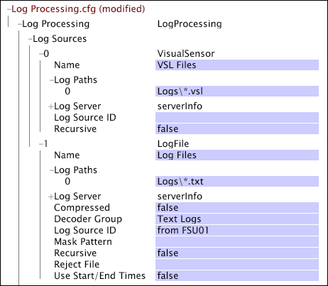

# 記錄來源{#log-sources}

日誌源是包含用於構建資料集的資料的檔案。

日誌源中可用的資料稱為事件資料，因為每個資料記錄代表事務記錄或事件的單個實例。 資料工作台伺服器可處理衍生自其他資料來源所收集或擷 [!DNL Sensors] 取之資料的記錄來源。

* **資料收集方 [!DNL Sensors]式：**從HTTP和應用程式伺 [!DNL Sensors] 服器收集的資料會傳送至資料工作台伺服器，以將資料轉換為高度壓縮的記錄檔( [!DNL .vsl])檔案。 請參閱 [感測器檔案](../../../home/c-dataset-const-proc/c-log-proc-config-file/c-log-sources.md#concept-b25f11c477b54032a15b6117b3bf9009)。

* **Insight Server擷取的資料：** 資料工作台伺服器讀取平面檔案、XML檔案或ODBC相容資料庫中包含的事件資料，並使用其解碼器來提取所需的資料元素。 此類事件資料不一定駐留在記憶體中，但包含資料的記錄必須包含追蹤ID。 請參 [閱日誌檔案](../../../home/c-dataset-const-proc/c-log-proc-config-file/c-log-sources.md#concept-3d4fb817c057447d90f166b1183b461e)、 [XML日誌源](../../../home/c-dataset-const-proc/c-log-proc-config-file/c-log-sources.md#concept-c7b154e93748447b986e97f6ef688887)和 [ODBC資料源](../../../home/c-dataset-const-proc/c-log-proc-config-file/c-odbc-data-sources.md#concept-5f2cf635081d44beab826ef5ec8cf4e3)。

**要添加日誌源，請執行以下操作：**

1. 在資料 [!DNL Log Processing.cfg] 工作台中開啟。
1. 按一下滑鼠右 **[!UICONTROL Log Sources]**&#x200B;鍵，然後按一下 **[!UICONTROL Add New]**。

1. 選取下列其中一項:

   * **[!UICONTROL Sensor]**
   * **[!UICONTROL Log File]**
   * **[!UICONTROL XML Log Source]**
   * **[!UICONTROL ODBC Data Source]**

1. 用於定義資料集的特定參數會根據資料集配置過程中要使用的日誌源的類型而有所不同。 指定與相應日誌源對應的部分中指示的參數：

   * [感測器檔案](../../../home/c-dataset-const-proc/c-log-proc-config-file/c-log-sources.md#concept-b25f11c477b54032a15b6117b3bf9009)
   * [日誌檔案](../../../home/c-dataset-const-proc/c-log-proc-config-file/c-log-sources.md#concept-3d4fb817c057447d90f166b1183b461e)
   * [XML記錄檔來源](../../../home/c-dataset-const-proc/c-log-proc-config-file/c-log-sources.md#concept-c7b154e93748447b986e97f6ef688887)
   * [ODBC資料源](../../../home/c-dataset-const-proc/c-log-proc-config-file/c-odbc-data-sources.md#concept-5f2cf635081d44beab826ef5ec8cf4e3)

1. 在檔案中定義記錄檔來源（並變更其他參數）後，請將檔案儲存在本機 [!DNL Log Processing.cfg] ，然後儲存到資料工作台伺服器上的資料集描述檔。

   >[!NOTE]
   >
   >資料工作台伺服 [!DNL File Server Unit] 器可接收和儲存檔 [!DNL Sensor] 案、記錄檔和XML檔案，並將它們提供給資料工作台伺服器，以建 [!DNL Data Processing Units] 立資料集。 請參 [閱設定Insight伺服器檔案伺服器裝置](../../../home/c-dataset-const-proc/c-log-proc-config-file/c-ins-svr-file-svr-unit.md#concept-995abff3fce34e439fb3f7f47191c80d)。

   您可以從中開啟任何日誌源的配置 [!DNL Transformation Dependency Map]。 如需相關資訊， [!DNL Transformation Dependency Map]請參閱資 [料集設定工具](../../../home/c-dataset-const-proc/c-dataset-config-tools/c-dataset-config-tools.md#concept-6e058b7691834cf79dcfd1573f78d4f5)。

<!--
c_sensor_files.xml
-->

## 需求 {#section-d5901a4872774ad5bd01a18db114f1f2}

從HTTP和應用程 [!DNL Sensors] 式伺服器收集的事件資料會傳送至資料工作台伺服器，以將資料轉換為高度壓縮的記錄檔( [!DNL .vsl])檔案。 檔 [!DNL .vsl] 案格式由資料工作台伺服器管理，且每個檔案皆有下列格式名稱：

YYYYMMDD-*SENSORID*.VSL

其中，YYYYMMDD是檔案的日期， *SENSORID* 是名稱（由您的組織指派），指出是 [!DNL Sensor] 否收集資料並將資料傳送至資料工作台伺服器。

## 參數 {#section-5c3f1e341c284486aeba3452057da7f3}

對於 [!DNL Sensor] 檔案，可使用以下參數：

<table id="table_F583B475600041AFA3B9399AE0592146"> 
 <thead> 
  <tr> 
   <th colname="col1" class="entry"> 參數 </th> 
   <th colname="col2" class="entry"> 說明 </th> 
  </tr> 
 </thead>
 <tbody> 
  <tr> 
   <td colname="col1"> 日誌路徑 </td> 
   <td colname="col2"> 
.vsl檔案  的儲存目錄 。 預設位置是「日誌」目錄。 相對路徑是指資料工作台伺服器的安裝目錄。 
 
您可以使用萬用字元來指定要處  理的。vsl 檔案： 
     <ul id="ul_AE144ED0FAB94FE8B32599A058659DE1"> 
      <li id="li_1E4E4CFD72C34B5EB71A3C59877950A9"> *符合任意數字元 </li> 
      <li id="li_4664400FC12E44B39B28438B85D20ED8"> ? 符合單一字元 </li> 
     </ul> 
 
 例如，日誌路徑  Logs\*.vsl ，與Logs目錄中以。vsl結尾的任何檔案  匹配。 日誌路徑  Logs\*-SENSOR?.vsl 與Logs目錄中的檔案匹配，其中包含任何日期(YYYYMMDD)和SENSOR後面的一個字元，如SENSOR1中所示。 
 
 如果要搜索指定路徑的所有子目錄，必須將Recursive參數設定為true。 
 
 
注意：如果要從資料工作台伺服器的檔案伺服器單元讀取檔案 ，則必須在「日誌路徑」參數中輸入相應的URI。 例如，  URI /Logs/*-*.vsl ，與Logs目錄中的  .vsl 檔案匹配。 請參 <a href="../../../home/c-dataset-const-proc/c-log-proc-config-file/c-ins-svr-file-svr-unit.md#concept-995abff3fce34e439fb3f7f47191c80d"> 閱設定Insight伺服器檔案伺服器裝置</a>。 
 
 </td> 
  </tr> 
  <tr> 
   <td colname="col1"> 日誌伺服器 </td> 
   <td colname="col2">連接到檔案伺服器所需的資訊（地址、名稱、埠等）。 如果日誌伺服器參數中有條目，則日  志路徑 被解釋為URI。 否則，它們會被解釋為本地路徑。 請參 <a href="../../../home/c-dataset-const-proc/c-log-proc-config-file/c-ins-svr-file-svr-unit.md#concept-995abff3fce34e439fb3f7f47191c80d"> 閱設定Insight伺服器檔案伺服器裝置</a>。 </td> 
  </tr> 
  <tr> 
   <td colname="col1"> 日誌源ID </td> 
   <td colname="col2"> 
此參數的值可以是任何字串。 如果指定了值，此參數可讓您區分不同日誌源中的日誌條目，以用於源標識或目標處理。 x-log-source-id欄位會填入一個值，用以識別每個記錄項目的記錄來源。 例如，如果要從名為  VSensor01的 Sensor  （感測器）中標識日誌條目，則可從VSensor01（感測器）鍵入，該字串將被傳遞到源中每個日誌條目的x-log-source-id欄位。 
 
 如需x-log-source-id欄位的詳細資訊，請參閱事件資 <a href="../../../home/c-dataset-const-proc/c-ev-data-rec-fields.md#concept-06bda4be1a4649a2905a4422e9e6c42f"> 料記錄欄位</a>。 
 </td> 
  </tr> 
  <tr> 
   <td colname="col1"> 遞歸 </td> 
   <td colname="col2"> 是非。 如果設定為true，則搜索「日誌路徑」中指定的每個路徑的所有子目錄  ，以查找與指定檔案名或通配符模式匹配的檔案。 預設值為 false。 </td> 
  </tr> 
  <tr> 
   <td colname="col1"> 使用開始／結束時間 </td> 
   <td colname="col2"> 
是非。 如果設定為true並指定了「開始時間」或「結束時間」，則此日誌源的所有檔案都必須具有以ISO格式(YYYYMMDD)的日期開始的檔案名。 假設每個檔案包含一天（例如，從一天0000 GMT開始到第二天000 GMT結束的時間範圍）的資料。 如果記錄來源檔案包含的資料與GMT日期不對應，則此參數必須設為false，以避免產生錯誤結果。 
 
 
注意：預設情況下，  .vsl文 件包含  Sensor收集的資料，自動滿足上述命名和時間範圍要求。 如果將此參數設為true，資料工作台伺服器一律會處理名稱包含ISO日期且落在指定「開始時間」和「結束時間」之間之檔案的資料。 如果您將此參數設為false，資料工作台伺服器會在記錄處理期間讀取所有  .vsl 檔案，以判斷哪些檔案包含「開始時間」和「結束時間」範圍內的資料。 
 
 
 如需「開始時間」和「結束時間」參數的詳細資訊，請參閱資 <a href="../../../home/c-dataset-const-proc/c-log-proc-config-file/c-info-log-proc-param.md#concept-41bd49bf6b64442d91c232ec67529a3d"> 料篩選</a>。 
 </td> 
  </tr> 
 </tbody> 
</table>

>[!NOTE]
>
>請勿使用資料來源的 [!DNL Sensor] 設定參數來判斷應將記錄檔中的哪些記錄項目納入資料集。 請改為設定資料源以指向目錄中的所有日誌檔案。 然後，使用的「開始時間」和「結束時間」 [!DNL Log Processing.cfg] 參數來決定在建立資料集時應使用哪些記錄項目。 請參閱 [資料篩選](../../../home/c-dataset-const-proc/c-log-proc-config-file/c-info-log-proc-param.md#concept-41bd49bf6b64442d91c232ec67529a3d)。

<!--
c_log_files.xml
-->

包含事件資料的檔案必須符合下列要求：

* 檔案中的每個事件資料記錄都必須用一行表示。
* 記錄中的欄位必須以ASCII分隔字元分隔，不論是否空白。 資料工作台伺服器不需要您使用特定的分隔字元。 您可以使用非行尾字元且未顯示在事件資料本身任何位置的任何字元。
* 檔案中的每個記錄必須包含：

   * 追蹤ID
   * 時間戳記

* 若要指定資料處理的開始和結束時間，每個檔案名稱必須採用下列格式：

   * [!DNL YYYYMMDD-SOURCE.log]
   其中 *YYYYMMDD* 是檔案中所有資料的格林威治標準時間(GMT)天， *SOURCE* 是識別檔案中資料來源的變數。

   >[!NOTE]
   >
   >請連絡Adobe諮詢服務，以檢視您計畫併入資料集的記錄檔。

## 參數 {#section-83a861ac24954d54bbb9530e4d8bf23c}

對於日誌檔案日誌源，下表中的參數可用。

>[!NOTE]
>
>處理日誌檔案日誌源需要在檔案中定義的附加參數，該參數包含檔案中所包含的參數子集，以及用於定義從日誌檔案中提取資料的解碼器的特殊參數。 [!DNL Log Processing Dataset Include][!DNL Log Processing.cfg] 如需定義記錄檔記錄檔來源的解碼器的詳細資訊，請參 [閱文字檔解碼器群組](../../../home/c-dataset-const-proc/c-dataset-inc-files/c-types-dataset-inc-files/c-log-proc-dataset-inc-files/c-text-file-dec-groups.md#concept-0db34988e17c41bfb1797f1d8e78aabd)。

<table id="table_F33735B5B90A48B0B21FA02D9198CCA9"> 
 <thead> 
  <tr> 
   <th colname="col1" class="entry"> 參數 </th> 
   <th colname="col2" class="entry"> 說明 </th> 
  </tr> 
 </thead>
 <tbody> 
  <tr> 
   <td colname="col1"> 名稱 </td> 
   <td colname="col2"> 日誌檔案源的標識符。 </td> 
  </tr> 
  <tr> 
   <td colname="col1"> 日誌路徑 </td> 
   <td colname="col2"> 
儲存日誌檔案的目錄。 預設位置是「日誌」目錄。 相對路徑是指資料工作台伺服器的安裝目錄。 
 
 您可以使用萬用字元來指定要處理哪些記錄檔： 
     <ul id="ul_1F02D26A08D846E2A3114E5C33F60ECF"> 
      <li id="li_ECAE1C03A1C448A1B86AE00B3A955708"> *符合任意數目的字元。 </li> 
      <li id="li_24FDB500C5934CAAA4124C435DF4B290"> ? 匹配單個字元。 </li> 
     </ul> 
 
 例如，日誌路徑  Logs\*.log 與Logs目錄中以。log結尾的任何檔案  匹配。 
 
 如果要搜索指定路徑的所有子目錄，則必須將Recursive參數設定為true。 
 
 如果要從資料工作台伺服器的檔案伺服器單元讀取檔案 ，則必須在「日誌路徑」參數中輸入相應的URI。 例如，  URI/Logs/*.log 與Logs目錄中的  .log檔案匹配。 請參 <a href="../../../home/c-dataset-const-proc/c-log-proc-config-file/c-ins-svr-file-svr-unit.md#concept-995abff3fce34e439fb3f7f47191c80d"> 閱設定Insight伺服器檔案伺服器裝置</a>。 
 </td> 
  </tr> 
  <tr> 
   <td colname="col1"> 日誌伺服器 </td> 
   <td colname="col2"> 連接到檔案伺服器所需的資訊（地址、名稱、埠等）。 如果日誌伺服器參數中有條目，則日  志路徑 被解釋為URI。 否則，它們會被解釋為本地路徑。 請參 <a href="../../../home/c-dataset-const-proc/c-log-proc-config-file/c-ins-svr-file-svr-unit.md#concept-995abff3fce34e439fb3f7f47191c80d"> 閱設定Insight伺服器檔案伺服器裝置</a>。 </td> 
  </tr> 
  <tr> 
   <td colname="col1"> 已壓縮 </td> 
   <td colname="col2"> 是非。 如果要由資料工作台伺服器讀取的記錄檔是壓縮的gzip檔案，此值應設為true。 </td> 
  </tr> 
  <tr> 
   <td colname="col1"> 解碼器群組 </td> 
   <td colname="col2"> 要應用於日誌檔案日誌源的文本檔案解碼器組的名稱。 此名稱必須與「記錄處理資料集包含」檔案中指定之對應文字檔案解碼  器群組的名稱完全相符 。 請參閱 <a href="../../../home/c-dataset-const-proc/c-dataset-inc-files/c-types-dataset-inc-files/c-log-proc-dataset-inc-files/c-text-file-dec-groups.md#concept-0db34988e17c41bfb1797f1d8e78aabd"> 文字檔案解碼器群組</a>。 </td> 
  </tr> 
  <tr> 
   <td colname="col1"> 日誌源ID </td> 
   <td colname="col2"> 
此參數的值可以是任何字串。 如果指定了值，此參數可讓您區分不同日誌源中的日誌條目，以用於源標識或目標處理。 x-log-source-id欄位會填入一個值，用以識別每個記錄項目的記錄來源。 例如，如果要從名為LogFile01的日誌檔案源中標識日誌條目，則可以從  LogFile01鍵入，該字串將傳遞到源中每個日誌條目的x-log-source-id欄位。 
 
 如需x-log-source-id欄位的詳細資訊，請參閱事件資 <a href="../../../home/c-dataset-const-proc/c-ev-data-rec-fields.md#concept-06bda4be1a4649a2905a4422e9e6c42f"> 料記錄欄位</a>。 
 </td> 
  </tr> 
  <tr> 
   <td colname="col1"> 遮色片圖樣 </td> 
   <td colname="col2"> 
具有單個捕獲子模式的規則運算式，它提取用於標識一系列日誌檔案源的一致名稱。 僅考慮檔案名。 規則運算式比對不會考慮路徑和擴充功能。 如果您未指定遮色片  圖樣，則會自動產生遮色片。 
 
 對於檔案  Logs\010105server1.log 和  Logs\010105server2.log,  掩碼模式應為[0-9]{6}(。*). 此模式會從上述的檔案名稱中擷取字串"server1"或"server2"。 
 
 請參閱 <a href="../../../home/c-dataset-const-proc/c-reg-exp.md#concept-070077baa419475094ef0469e92c5b9c"> 規則運算式</a>。 
 </td> 
  </tr> 
  <tr> 
   <td colname="col1"> 遞歸 </td> 
   <td colname="col2"> 是非。 如果此參數設定為true，則搜索「日誌路徑」中指定的每個路徑的所有子目錄，以查找與指定檔案名或通配符模式匹配的檔案。  預設值為 false。 </td> 
  </tr> 
  <tr> 
   <td colname="col1"> 拒絕檔案 </td> 
   <td colname="col2"> 包含不符合解碼器條件的日誌條目的檔案的路徑和檔案名。 </td> 
  </tr> 
  <tr> 
   <td colname="col1"> 使用開始／結束時間 </td> 
   <td colname="col2"> 
是非。 如果此參數設為true且指定「開始時間」或「結束時間」，則此日誌源的所有檔案都必須具有以ISO格式(YYYYMMDD)的日期開始的檔案名。 假設每個檔案包含一天（例如，從一天0000 GMT開始到第二天000 GMT結束的時間範圍）的資料。 如果日誌源檔案名不以ISO日期開頭，或者如果檔案包含的資料與GMT日期不對應，則必須將此參數設定為false以避免錯誤結果。 
 
 
注意： 如果上述對日誌檔案的命名和時間範圍要求滿足，並且您將此參數設定為true，則指定的文本檔案解碼器組將讀取的檔案限制為那些名稱具有ISO日期且落在指定開始時間和結束時間之間的檔案。 如果您將此參數設為false，資料工作台伺服器會在記錄處理期間讀取所有記錄檔，以判斷哪些檔案包含「開始時間」和「結束時間」範圍內的資料。 
 
 
 如需「開始時間」和「結束時間」參數的詳細資訊，請參閱資 <a href="../../../home/c-dataset-const-proc/c-log-proc-config-file/c-info-log-proc-param.md#concept-41bd49bf6b64442d91c232ec67529a3d"> 料篩選</a>。 
 </td> 
  </tr> 
 </tbody> 
</table>

在此範例中，資料集是由兩種記錄來源來建構。

日誌源0指定由捕獲的事件資料生成的日誌檔案 [!DNL Sensor]。 此資料源指向一個名為「日誌」的目錄，以及該目錄中具有檔案副檔名的所有 [!DNL .vsl] 檔案。

Log Source 1指向Logs目錄中具有副檔名的所有 [!DNL .txt] 檔案。 此記錄檔來源的解碼器群組稱為「文字記錄檔」。

定義資料集的資料源後，不應刪除或移動日誌檔案。 只應將新建立的日誌檔案添加到資料源的目錄中。

<!--
c_xml_log_sources.xml
-->

包含事件資料的檔案必須符合下列要求：

* 事件資料必須包含在格式正確且具有適當父子關係的XML檔案中。
* 每個XML檔案格式必須有唯一的解碼器群組。 如需有關建構解碼器群組的資訊，請參閱「 [XML解碼器群組」](../../../home/c-dataset-const-proc/c-dataset-inc-files/c-types-dataset-inc-files/c-log-proc-dataset-inc-files/c-xml-dec-grps.md#concept-5eda5ab253724674832f6951e2a0d1c3)。
* 檔案中的每個訪客記錄必須包含：

   * 追蹤ID
   * 時間戳記

* 若要指定資料處理的開始和結束時間，每個檔案名稱必須為

[!DNL YYYYMMDD-SOURCE.log]

其中 *YYYYMMDD* 是檔案中所有資料的格林威治標準時間(GMT)天， *SOURCE* 是識別檔案中資料來源的變數。

如需符合這些需求的XML檔案範例，請參閱 [XML解碼器群組](../../../home/c-dataset-const-proc/c-dataset-inc-files/c-types-dataset-inc-files/c-log-proc-dataset-inc-files/c-xml-dec-grps.md#concept-5eda5ab253724674832f6951e2a0d1c3)。

>[!NOTE]
>
>請連絡Adobe諮詢服務，以檢視您計畫將之整合至資料集的XML記錄檔。

## 參數 {#section-d07b96d7f6ad4affb9cc0a0bc1b88c4d}

對於XML日誌源，下表中的參數可用。

>[!NOTE]
>
>處理XML日誌源需要在檔案中定義的附加參數，該檔案包含包含在檔案中的參數子集，以及用於定義從XML檔案中提取資料的解碼器的特殊參數。 [!DNL Log Processing Dataset Include][!DNL Log Processing.cfg] 如需定義XML記錄檔來源的解碼器的詳細資訊，請參閱「 [XML解碼器群組」](../../../home/c-dataset-const-proc/c-dataset-inc-files/c-types-dataset-inc-files/c-log-proc-dataset-inc-files/c-xml-dec-grps.md#concept-5eda5ab253724674832f6951e2a0d1c3)。

<table id="table_86B849F379CF4FEBA9294ACEF8F55184"> 
 <thead> 
  <tr> 
   <th colname="col1" class="entry"> 欄位 </th> 
   <th colname="col2" class="entry"> 說明 </th> 
  </tr> 
 </thead>
 <tbody> 
  <tr> 
   <td colname="col1"> 名稱 </td> 
   <td colname="col2"> XML日誌源的標識符。 </td> 
  </tr> 
  <tr> 
   <td colname="col1"> 日誌路徑 </td> 
   <td colname="col2"> 
儲存XML日誌源的目錄。 預設位置是「日誌」目錄。 相對路徑是指資料工作台伺服器的安裝目錄。 
 
 您可以使用萬用字元來指定要處理的XML記錄檔來源： 
     <ul id="ul_0AE5D0ADE0F64CFAA856492A49239F58"> 
      <li id="li_4CBC0D1733F04258B3A55CC6FA714538 "> *符合任意數字元 </li> 
      <li id="li_81B597436A1241FF94E73C18A0ABBFA1"> ? 符合單一字元 </li> 
     </ul> 
 
例如，日誌路徑  Logs\*.xml ，與Logs目錄中以。xml結尾的任何檔案  匹配。 
 
 如果要搜索指定路徑的所有子目錄，必須將「遞歸」(  Recursive )欄位設定為true。 
 
 
注意：如果要從資料工作台伺服器的檔案伺服器單元讀取檔案  ，則必須在「日誌路徑」(Log Paths  )欄位中輸入相應的URI。 例如，  URI/Logs/*.xml與Logs目錄中的 .xml檔案匹配。 請參 <a href="../../../home/c-dataset-const-proc/c-log-proc-config-file/c-ins-svr-file-svr-unit.md#concept-995abff3fce34e439fb3f7f47191c80d"> 閱設定Insight伺服器檔案伺服器裝置</a>。 
 
 </td> 
  </tr> 
  <tr> 
   <td colname="col1"> 日誌伺服器 </td> 
   <td colname="col2"> 連接到檔案伺服器所需的資訊（地址、名稱、埠等）。 如果「日誌伺服器」字  段中有條目 ，則「日誌路徑」  將被解釋為URI。 否則，它們會被解釋為本地路徑。 請參 <a href="../../../home/c-dataset-const-proc/c-log-proc-config-file/c-ins-svr-file-svr-unit.md#concept-995abff3fce34e439fb3f7f47191c80d"> 閱設定Insight伺服器檔案伺服器裝置</a>。 </td> 
  </tr> 
  <tr> 
   <td colname="col1"> 已壓縮 </td> 
   <td colname="col2"> 是非。 如果要由資料工作台伺服器讀取的XML記錄檔來源是壓縮的gzip檔案，此值應設為true。 </td> 
  </tr> 
  <tr> 
   <td colname="col1"> 解碼器群組 </td> 
   <td colname="col2"> 要套用至XML記錄檔來源的XML解碼器群組名稱。 此名稱必須與「記錄處理資料集包含」檔案中指定之對應XML解碼器  群組的名稱完全相符 。 請參閱 <a href="../../../home/c-dataset-const-proc/c-dataset-inc-files/c-types-dataset-inc-files/c-log-proc-dataset-inc-files/c-xml-dec-grps.md#concept-5eda5ab253724674832f6951e2a0d1c3"> XML解碼器群組</a>。 </td> 
  </tr> 
  <tr> 
   <td colname="col1"> 日誌源ID </td> 
   <td colname="col2"> 
此欄位的值可以是任何字串。 如果指定了值，則此欄位可讓您區分不同日誌源中的日誌條目，以用於源標識或目標處理。 x-log-source-id欄位會填入一個值，用以識別每個記錄項目的記錄來源。 例如，如果要從名為XMLFile01的日誌檔案源中標識日誌條目，則可以從  XMLFile01鍵入，該字串將傳遞到源中每個日誌條目的x-log-source-id欄位。 
 
 如需x-log-source-id欄位的詳細資訊，請參閱事件資 <a href="../../../home/c-dataset-const-proc/c-ev-data-rec-fields.md#concept-06bda4be1a4649a2905a4422e9e6c42f"> 料記錄欄位</a>。 
 </td> 
  </tr> 
  <tr> 
   <td colname="col1"> 遮色片圖樣 </td> 
   <td colname="col2"> 
具有單個捕獲子模式的規則運算式，它提取用於標識一系列日誌檔案源的一致名稱。 僅考慮檔案名。 規則運算式比對不會考慮路徑和擴充功能。 如果您未指定遮色片  圖樣，則會自動產生遮色片。 
 
 對於檔案  Logs\010105server1.xml 和  Logs\010105server2.xml，掩碼模式應為[0-9]{6}(。*). 此模式會從上述的檔案名稱中擷取字串"server1"或"server2"。 
 
 請參閱 <a href="../../../home/c-dataset-const-proc/c-reg-exp.md#concept-070077baa419475094ef0469e92c5b9c"> 規則運算式</a>。 
 </td> 
  </tr> 
  <tr> 
   <td colname="col1"> 遞歸 </td> 
   <td colname="col2"> 是非。 如果此參數設定為true，則搜索「日誌路徑」中指定的每個路徑的所有子目錄，以查找與指定檔案名或通配符模式匹配的檔案。  預設值為 false。 </td> 
  </tr> 
  <tr> 
   <td colname="col1"> 拒絕檔案 </td> 
   <td colname="col2"> 包含不符合解碼器條件的日誌條目的檔案的路徑和檔案名。 </td> 
  </tr> 
  <tr> 
   <td colname="col1"> 使用開始／結束時間 </td> 
   <td colname="col2"> 
是非。 如果此參數設為true且指定「開始時間」或「結束時間」，則此日誌源的所有檔案都必須具有以ISO格式(YYYYMMDD)的日期開始的檔案名。 假設每個檔案包含一天（例如，從一天0000 GMT開始到第二天000 GMT結束的時間範圍）的資料。 如果日誌源檔案名不以ISO日期開頭，或者如果檔案包含的資料與GMT日期不對應，則必須將此參數設定為false以避免錯誤結果。 
 
 
注意： 如果上述XML檔案的命名和時間範圍需求已滿足，而您將此參數設為true，則指定的XML解碼器群組會限制讀取的檔案，其名稱的ISO日期會落在指定的開始時間和結束時間之間。 如果將此參數設為false，資料工作台伺服器會在記錄處理期間讀取所有XML檔案，以判斷哪些檔案包含「開始時間」和「結束時間」範圍內的資料。 
 
 
 如需「開始時間」和「結束時間」參數的詳細資訊，請參閱資 <a href="../../../home/c-dataset-const-proc/c-log-proc-config-file/c-info-log-proc-param.md#concept-41bd49bf6b64442d91c232ec67529a3d"> 料篩選</a>。 
 </td> 
  </tr> 
 </tbody> 
</table>

>[!NOTE]
>
>在定義資料集的資料來源後，您不應刪除或移動XML記錄檔來源。 只應將新建立的XML檔案添加到資料源的目錄中。

<!--
AVRO-log-file.xml
-->

Avro資料饋送提供更有效率的方式，將資料整合至資料工作台：

<!--  -->

* Avro為流量和商務資料提供單一來源格式。
* Avro饋送是每天提供多個來源區塊的壓縮資料。 它僅提供填入的欄位，並提供監控和通知功能、歷史資料的存取權，以及自動復原。
* 架構（Avro日誌檔案的自定義佈局）包含在每個檔案的開頭處。
* 新增欄位並加上支援資訊，以便接收資料工作台資料，而不需對解碼器進行任何變更。 這些類別包括：

   * Evar:1-250（先前為1-75）
   * 自訂事件：1-1000（與1-100比較）
   * 存取行動、社交和視訊資料的解決方案變數

>[!NOTE]
>
>此外，使用Avro動態消息可立即存取動態消息中的任何新欄位，而不需關閉，讓欄位可以更新，而不需要服務時間。

Avro資料饋送會設定在個別檔案中：

* Avro **日誌檔案**:這是從解碼器產生的Avro記錄檔格式，用以格式化流量和商務資料。
* Avro解 **碼器檔案**:此檔案可讓您將值對應至新的Avro格式。 您可以使用Avro解碼器精靈來設定解碼器。

## Avro解碼器精靈 {#section-9a824b4c3d5549e7952a7111232035b2}

此嚮導將設定Avro解碼器日誌檔案。

若要開啟，請在工作區中按一下滑鼠右鍵，然後選 **取「管理** >精靈 **>** Avro Decoder Wizard ****」。

**步驟1:** 選 **擇Avro日誌檔案**。

在此步驟中，可以為Avro架構選擇源檔案。 可從日誌檔案(.log)或現有解碼器檔案(.avro)訪問模式。 可從任一檔案提取結構描述。

| **Avro記錄檔** | 按一下以開啟記錄檔(.log)檔案，以檢視記錄檔上方的架構並產生解碼器檔案。 |
|---|---|
| **Avro解碼器檔案** | 按一下以開啟並編輯現有解碼器(.avro)檔案的架構。 |

**步驟2:選擇輸入欄位**。

選擇要在資料集中使用的輸入欄位以通過日誌處理。 檔案中的所有欄位都會顯示，讓您選取動態消息的欄位。

>[!NOTE]
>
>如果 [!DNL x-product(Generates row)] 在資料中遇到陣列，則提供欄位。 此欄位為陣列中的嵌套資料生成新行作為輸入欄位。 例如，如果您有一個「點擊」列在陣列中包含許多「產品」值，則會在每個產品的輸入檔案中產生列。

| **選擇預設值** | 選擇要標識為標準預設欄位集的欄位。 |
|---|---|
| **選擇全部** | 選擇檔案中的所有欄位。 |
| **取消選擇全部** | 清除檔案中的所有欄位。 |

**步驟3:選擇要複製的欄位以生成行。**

由於新列可從陣列中的巢狀值建立，因此每個建立的新列都必須有追蹤ID和時間戳記。 此步驟允許您選擇要從父記錄複製到行的欄位，如跟蹤ID和時間戳記。 您也可以選取要新增至每一列的其他值。

| **選擇預設值** | 選取一組標準預設欄位，這些欄位需要新增欄值至每一列，例如追蹤ID和時間戳記。 例如，欄 [!DNL hit_source] 位是新增至每一新列所需的預設值（在清單中定義為預設值）。 您可以視需要將其他欄值新增至每一列。 |
|---|---|
| **選擇全部** | 選擇檔案中的所有欄位。 |
| **取消選擇全部** | 清除檔案中的所有欄位。 |

使用「 **搜尋** 」方塊在清單中尋找值。

**步驟4：指定解碼器名稱**

指定欄位群組的名稱，並儲存為解碼器檔案。 名稱應符合您的記錄來源中指定的解碼器群組名稱。

**步驟5:儲存解碼器檔案。**

檔案選單將會開啟，以命名解碼器檔案，並儲存為 [!DNL .cfg] 「記錄檔」檔 **案夾中** 。
