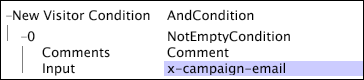

# 新訪客條件{#new-visitor-condition}

「新訪客條件」是「條件操作」，用於網站資料，以判斷哪些訪客被視為要納入資料集。

定 [!DNL New Visitor Condition] 義要在資料集中使用的訪客的第一個記錄項目（依時間排序），此訪客的所有後續記錄項目都會納入資料集中，不論其是否符合此條件。 由於需 [!DNL New Visitor Condition] 要依訪客和時間排序資料，因此資料只會在資料集建構的轉換階段套用。

此范 [!DNL New Visitor Condition] 例中所示的資料集會為回應電子郵件促銷活動的訪客建立僅包含這些記錄項目的資料集。 這是使用測試(請參 [!DNL NotEmptyCondition] 閱非空 [白](../../../../home/c-dataset-const-proc/c-conditions/c-test-ops/c-test-op-con.md#section-1decb9d887894073a1b6b3d985729ac8))和欄位作為規則運 [!DNL x-campaign-email] 算式的輸入來完成的。 在識別符合條件的新訪客後，會擷取這些訪客的所有記錄項目。

