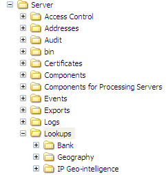

# 安裝資料服務查閱檔案{#installing-the-data-service-lookup-files}

安裝IP地理情報或IP地理位置查閱檔案的步驟。

資料服務設定檔隨附的查閱檔案（查閱\*設定檔名稱*\*資料檔案名稱*）是二進位檔案([!DNL .bin])，包含以IP位址為基礎的地理位置相關資料。 您必須定期替換此檔案，以確保擁有最新的地理資料。 請參閱[更新資料服務檔案](../../../../home/c-geo-oview/c-wk-data-svcs/c-updt-data-svc-files.md#concept-2b3d11e4cb814fc09add5de58a87045c)。

**安裝IP地理情報或IP地理位置查閱檔案**

>[!NOTE]
>
>所有[!DNL IP Geo-location]或[!DNL IP Geo-intelligence]資料檔案都必須符合Data Workbench伺服器的可用物理記憶體。

1. 從您從Adobe接收的[!DNL .zip]檔案開啟「查閱」資料夾。
1. 將IP地理情報或IP地理位置資料夾複製到Data Workbench伺服器安裝目錄中的「查詢」資料夾(您最後想要的是……\Lookups\IP Geo-intelligence or a ...\Lookups\IP Geo-location folder on your data workbench server as shown in the following example。 「查找」資料夾中其他資料夾的名稱可能與顯示的名稱不同。

   

   >[!NOTE]
   >
   >Adobe會定期向您發送包含更新[!DNL IP Geo-intelligence]或[!DNL IP Geo-location]查閱檔案的檔案。 收到這些檔案時，您需要依照Adobe的指示，將它們載入至Data Workbench伺服器。 如需指示，請參閱下節。
