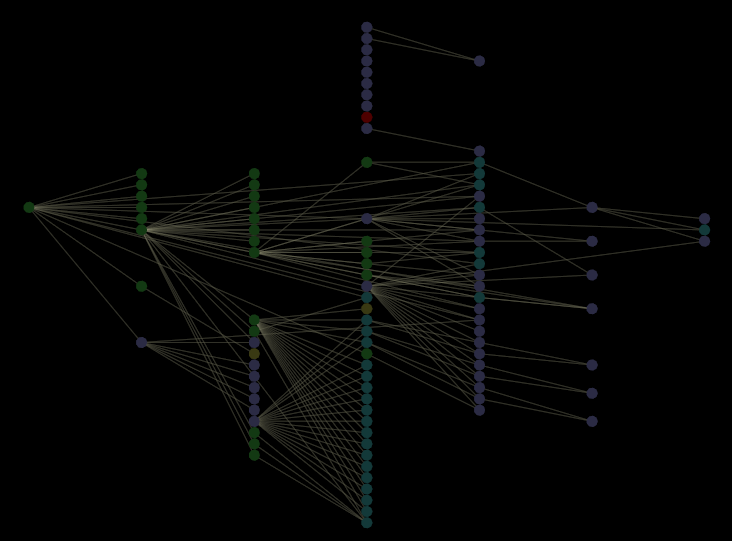

# 查詢模型元件{#query-model-components}

{{eol}}

關於查詢模型元件的概念資訊。

下圖顯示一個相依性映射，其節點代表查詢模型的度量、派生維和篩選器，這些篩選器在配置檔案中的「Dimension」、「度量」和「篩選器」資料夾中定義，在資料集中定義的擴展維（以某種方式與它們相關）。

* 黃綠色節點代表篩選器。
* 紫色節點代表量度。
* 藍綠色節點代表衍生維度。
* 綠色節點代表延伸維度（在資料集中定義）。
* 紅色節點代表量度、衍生維度或篩選器，其依賴關係或循環中斷或其他錯誤。

>[!NOTE]
>
>由於依賴關係映射的設計是為了適應無環依賴關係，因此循環依賴關係中涉及的節點可能無法在映射上正確顯示。 您可以在 [!DNL Search] 框。 如需 [!DNL Search] 功能，請參閱 [在地圖中搜尋](../../../../../home/c-get-started/c-admin-intrf/c-dataset-mgrs/c-dep-maps/t-srch-map.md#task-a1e7065a538d46c78a7d28676d880dfb).
