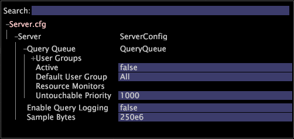

# 查詢佇列{#query-queue}

通常，Data Workbench伺服器在接收到傳入用戶查詢時會回答這些查詢，並繼續提供結果和即時更新，直到用戶不再請求查詢為止。

有時，特別是在具有許多Data Workbench用戶的系統上，活動查詢的數量需要的系統資源比伺服器所提供的更多。 [!DNL Query Queue] 允許伺服器將某些查詢暫時保留，直到提供答案所需的資源可用為止。[!DNL Query Queue]還提供功能，可根據各種參數來排定查詢的優先順序，以便在資源爭用時，優先順序較高的查詢會被優先回答。

來自單一用戶端或報告伺服器的查詢會放在一串中，並排程為單位。 您可以配置資源監視器以限制查詢使用的特定系統資源量。 當被監控的資源允許調度另一個查詢簇時，調度優先順序最高的簇。 由於資源限制，尚未排程查詢的用戶不會收到錯誤，但會收到查詢已排入佇列的通知，並且用戶可以繼續處理本地示例。

預設配置包括[!DNL Query Queue]的簡單配置，但使其處於禁用狀態。 管理員可以啟用或禁用[!DNL Query Queue]、配置資源監視器以確定用於查詢的各種資源的數量，以及為不同用戶配置複雜的優先順序策略。

**若要設定Server.cfg檔案，請[!DNL Query Queuing]**

1. 按一下&#x200B;**[!UICONTROL Admin]** > **[!UICONTROL Profile Manager]** > **[!UICONTROL Dataset]**&#x200B;以開啟[!DNL Server.cfg]。
1. 按一下右鍵&#x200B;**[!UICONTROL Server.cfg]**&#x200B;並使其成為本地編輯。
1. 展開 [!DNL Query Queue].

   

1. 設定下列參數：

   * **使用者群組：** 可讓您設定原則、使用者和佇列優先順序。有關定義，請參見[查詢隊列用戶組](../../../../home/c-get-started/c-admin-intrf/c-query-que/c-query-que-user-grps.md#concept-5555f51402ed49419c067d61738474c1)。

   * **活動：** （向量）啟用或停用 [!DNL Query Queue]。有效值為true或false。 預設設定為false。

   * **預設使用者群組：** （字串）如果使用者未列在任何使用者群組中，請輸入其使用者所加入之使用者群組的名稱。
   * **資源監視器：** （向量）按一下右鍵以添加資源監視器。您可以指定[!DNL Query Queue]監視記憶體還是查詢數。 按一下右鍵&#x200B;**[!UICONTROL Resource Monitor]** ，選擇「Memory Budget Monitor（記憶體預算監視器）」或「Number of Queries Monitor（查詢數監視器）」。 有關詳細資訊，請參閱[查詢隊列資源監視器](../../../../home/c-get-started/c-admin-intrf/c-query-que/c-query-que-res-mon.md#concept-0840967b228c4d5ba3b59b4b2759f325)。

   * **不可觸碰優先順序：** (Int)指定優先順序大於或等於此值的串絕不會被搶佔，以排程高優先順序串。與[用戶組參數表](../../../../home/c-get-started/c-admin-intrf/c-query-que/c-query-que-user-grps.md#concept-5555f51402ed49419c067d61738474c1)中描述的[!DNL Memory Budget Monitor]一起使用。
