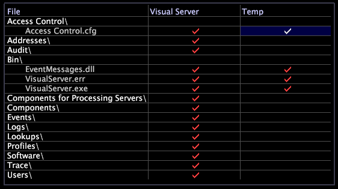

# 伺服器檔案管理員{#server-files-manager}

{{eol}}

「伺服器檔案管理器」允許您通過提供對產品安裝目錄中所有目錄和檔案（包括配置和查找檔案）的訪問，從任何授權Data Workbench遠程管理和管理Data Workbench伺服器電腦。

您可以存取 [!DNL Server Files Manager] 使用 [!DNL Admin] ，也可以按一下右鍵Data Workbench伺服器電腦的節點 [!DNL Servers Manager] 按一下 **[!UICONTROL Server Files]**.

>[!NOTE]
>
>您可以建立顯示所選目錄的新伺服器檔案管理器。 請參閱 [建立新的伺服器檔案管理器](../../../home/c-get-started/c-intf-anlys-ftrs/c-cstm-prof-files-mgrs/c-new-svr-files-mgrs.md#concept-6e8f63273109443699a8f61b1a2ea816).

的左欄 [!DNL Server Files Manager] 列出檔案和資料夾名稱。 中央和右側列中的勾號表示這些目錄和檔案在檔案結構中的位置。

如果檔案位於產品的安裝目錄中，則 *伺服器名稱* (例如，Data Workbench伺服器)欄包含勾號。 如果檔案位於Data Workbench用戶的電腦上， *Data Workbench安裝目錄*\Temp目錄， [!DNL Temp] 列包含複選標籤。 檢查標籤的顏色指示是否同時修改了駐留在不同位置的檔案。

* 伺服器名稱列中的紅色複選標籤表示資料夾或檔案駐留在Data Workbench伺服器電腦上。
* 中的紅色勾號 [!DNL Temp] 列指示檔案或資料夾的本地副本具有與Data Workbench伺服器電腦上的檔案或資料夾相同的修改日期和時間。
* 此 [!DNL Temp] 欄指示 *Data Workbench安裝目錄*\Temp目錄的修改日期和時間與Data Workbench伺服器電腦上的檔案或資料夾不同。

下圖顯示 [!DNL Server Files Manager] 帶有紅色和白色的勾號：

**要使用[!DNL Server Files Manager]**

您可以使用 [!DNL Server Files Manager] 操作Data Workbench伺服器電腦上的目錄和檔案。

下表列出可使用 [!DNL Server Files Manager]:

<table id="table_D217AE5A878542EC8B604812A61819C3"> 
 <thead> 
  <tr> 
   <th colname="col1" class="entry"> 要執行此任務…… </th> 
   <th colname="col2" class="entry"> 執行動作... </th> 
  </tr> 
 </thead>
 <tbody> 
  <tr> 
   <td colname="col1"> 
查看任何目錄中的檔案 
 </td> 
   <td colname="col2"> 
按一下目錄名稱以檢視其內容。 
 </td> 
  </tr> 
  <tr> 
   <td colname="col1"> 
隱藏目錄的內容 
 </td> 
   <td colname="col2"> 
按一下目錄名稱。 
 </td> 
  </tr> 
  <tr> 
   <td colname="col1"> 
要查看有關目錄的詳細資訊 
 </td> 
   <td colname="col2"> 
按一下右鍵伺服器名稱或  臨時 欄。 您會看到下列資訊： 
 
    <ul id="ul_2DA5C8D0E95F4BCC8F7E25D05F00EB02"> 
     <li id="li_3FDECC14D62543B183C3509C338DF432">路徑. 目錄的路徑。 </li> 
     <li id="li_9CF3989FD9E2427995F070E043FAD02C">目錄。 目錄的名稱。 </li> 
     <li id="li_68AAA11907404D0BBF407ECD7CA2E467">從. 目錄、遠程或臨時的位置。 </li> 
     <li id="li_CB4AEEC89E424868B758465EC0B701B5">日期（僅限臨時欄）。 建立日期或本地副本的上次修訂日期。 </li> 
    </ul> </td> 
  </tr> 
  <tr> 
   <td colname="col1"> 
若要查看檔案的詳細資訊 
 </td> 
   <td colname="col2"> 
在伺服器名稱或  臨時 欄。 您會看到下列資訊： 
 
 
     <ul id="ul_C4E6CB86D1774D739B5ECF48AF8DB628"> 
      <li id="li_7A6D39CF8C064FDDAB87F8D4E50FA832">路徑. 檔案的路徑。 </li> 
      <li id="li_9C735B6F0A2541F1992B845359C3685A">檔案. 檔案的名稱。 </li> 
      <li id="li_3EB903E4F4C44A6093732C588F0125EF">從. 目錄、遠程或臨時的位置。 </li> 
      <li id="li_C1FED4F98F854D5892DBAD9F9E1D47B8">日期. 檔案的最後修訂日期。 </li> 
      <li id="li_7477C727C62F4406BB2026063E41F2AE">大小. 檔案的大小。 </li> 
     </ul> 
 </td> 
  </tr> 
  <tr> 
   <td colname="col1"> 
將目錄下載到本地電腦 
 </td> 
   <td colname="col2"> 
以滑鼠右鍵按一下 <i>伺服器名稱</i> 欄，然後按一下  將目錄設為本地. 目錄的複選標籤會顯示在  臨時 欄。 
 </td> 
  </tr> 
  <tr> 
   <td colname="col1"> 
將檔案下載到本地電腦 
 </td> 
   <td colname="col2"> 
以滑鼠右鍵按一下 <i>伺服器名稱</i> 欄，然後按一下  使本地. 檔案的勾選記號會顯示在  臨時 欄。 
 </td> 
  </tr> 
  <tr> 
   <td colname="col1"> 
將日誌檔案的最後一部分下載到本地電腦 
 </td> 
   <td colname="col2"> 
要避免下載整個日誌檔案（尤其是當您知道錯誤消息接近檔案結尾時），請按一下右鍵該檔案的「伺服器名稱」列中的複選標籤，按一下  尾部，然後選取您要下載的部分大小。 檔案的勾選記號會顯示在  臨時 欄。 本機檔案僅包含您指定的資料量，從檔案結尾開始。 
 </td> 
  </tr> 
  <tr> 
   <td colname="col1"> 
開啟目錄 
 </td> 
   <td colname="col2"> 
按一下右鍵中目錄的複選標籤  臨時 欄，按一下  開啟 &gt;  資料夾. 
 </td> 
  </tr> 
  <tr> 
   <td colname="col1"> 
開啟檔案 
 </td> 
   <td colname="col2"> 
以滑鼠右鍵按一下  臨時 欄，按一下  開啟，然後按一下  Data Workbench,  記事本，或  資料夾. 
 </td> 
  </tr> 
  <tr> 
   <td colname="col1"> 
將目錄的本地副本保存到Data Workbench伺服器 
 </td> 
   <td colname="col2"> 
按一下右鍵中目錄的複選標籤  臨時 欄，按一下  將目錄保存到 &gt; <i>&lt; 設定檔名稱&gt;</i>. 
 </td> 
  </tr> 
  <tr> 
   <td colname="col1"> 
將檔案的本機副本儲存至Data Workbench伺服器 
 </td> 
   <td colname="col2"> 
以滑鼠右鍵按一下  臨時 欄，按一下  儲存至 &gt; <i>&lt; 設定檔名稱&gt;</i>. 
 </td> 
  </tr> 
  <tr> 
   <td colname="col1"> 
刪除目錄或檔案的本地副本 
 </td> 
   <td colname="col2"> 
按一下右鍵中目錄或檔案的複選標籤  臨時 欄，按一下  移除. 
 </td> 
  </tr> 
  <tr> 
   <td colname="col1"> 
在Microsoft Outlook中複製檔案並貼上為電子郵件附件 
 </td> 
   <td colname="col2"> 
以滑鼠右鍵按一下  臨時 欄，按一下  複製. 在電子郵件內文中，按Ctrl+v附加檔案。 
 </td> 
  </tr> 
 </tbody> 
</table>
