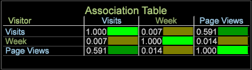

# 關聯表格視覺化{#association-table-visualization}

「關聯表格」視覺化功能可讓您使用Cramer的V演算法，將量度與量度、維度和維度元素建立關聯。

「關聯表」會將值與Cramer的V計算進行比較，而不是使用 [Correlation Matrix](https://docs.adobe.com/content/help/en/data-workbench/using/client/analysis-visualizations/correlation-analysis/c-correlation-analysis.html) and [Correlation Chord](https://docs.adobe.com/content/help/en/data-workbench/using/client/analysis-visualizations/c-chord-visualization.html) visualizations中使用的Pearson的相關係數(這些只能比較度量，而「關聯表」和「關聯Chord  」可以比較度量、維度和元素)。

## 建立關聯表 {#section-87ed12ccc1af4196a1b6534e621c4cbb}

「關聯表」會比較可計數或非可計數維度的量度。 可修改表格，以透過挑選顏色來反白標示視覺化中的關聯，或將其轉換為文字地圖、熱圖或兩者。

1. 開啟關聯表。

   以滑鼠右鍵按 [!DNL Visualization] 一下> [!DNL Predictive Analytics] > [!DNL Association Table]。

   

1. 選取延伸維度——點進、點擊、產品、瀏覽或訪客維度。 「關聯表」將開啟，其中角落中標識的擴展維及其關聯度量同時位於行和列中。

   

   關聯表使用Cramer的V作為對稱關聯，導致選定的度量、維度和元素值同時反映在關聯表的列和行中。 例如，選取 **Product****[!UICONTROL Visits]** Extended維度時，會在表格的列和欄中使用量度作為關聯量度，因此會產生完美但無用的比較(1.00)，因為比較值是相同的。

1. 向關聯表添加更多值。

   在欄或列中按一下滑鼠右鍵，然後選 **取新增量度****或新增維度**。 您也可以從 **Finder面板拖曳量度和維度** 。 維度元素也可以從開啟的表格拖放至表格視覺化。

   

   >[!NOTE]
   >
   >關聯表中允許10行和10列。

