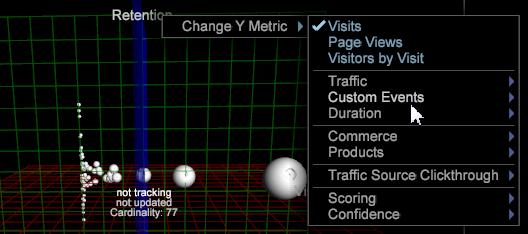

# 3D 散佈圖{#d-scatter-plots}

3D散布圖會在三維格線上繪製資料維度的元素（例如天數或反向連結網站），其中x、y和z軸代表各種量度。

與[散布圖2D](https://experienceleague.adobe.com/docs/data-workbench/using/client/t-open-ins.html#Scatter_Plots)一樣，此視覺效果在嘗試了解使用不同量度的大量不同項目之間的關係時非常有用。

**若要採用3D散布圖視覺效果：**

1. 開啟新工作區。

   開啟新工作區後，您可能需要按一下「**新增** > **暫時解除鎖定**」。
1. 按一下右鍵並選擇&#x200B;**Visualization** > **3D散布圖**。

   將開啟一個列出&#x200B;**[!UICONTROL Dimensions]**&#x200B;的菜單。

1. 選取查詢的維度。

   3D散布圖會開啟該維度的預設量度。

   

   選取&#x200B;**[!UICONTROL Days]**&#x200B;功能表會在下列軸上顯示下列3D散布圖及這些預設量度：**[!UICONTROL x=Visits]**、**[!UICONTROL y=Retention]**&#x200B;和&#x200B;**[!UICONTROL z=Visits]**。

1. 變更量度。 以滑鼠右鍵按一下x、y或z軸中的量度標籤，然後選取&#x200B;**[!UICONTROL Change Metric]**。 然後為選取的軸選取不同的量度。

   

   >[!IMPORTANT]
   >
   >
   >    
   >    
   >    * 將量度拖曳至三軸標籤中的一個，放置該標籤，將選取的軸變更為放置的量度。
   >    * 將量度拖曳至視覺效果的其他位置，並將其放置以變更該軸的半徑量度。
   >    * 將維度拖曳至視覺效果上的任何位置，並將其放置以變更視覺效果的維度。

1. 變更半徑量度。 以滑鼠右鍵按一下頁面頂端的標題（在選取的維度後面加上標題），然後選取&#x200B;**[!UICONTROL Change Radius Metric]**。

   半徑量度會根據量度選擇來定義繪製點的大小。 散布圖中點的相對位置沒有改變，但視覺效果中的繪製點大小會根據量度值增加。

   

1. 使用&#x200B;**[!UICONTROL Orthographic Camera]**。 此選項可讓您根據半徑量度來識別與其真實透視相關的繪圖點，以避免三維失真。

   當3D散布圖首次出現時，它會顯示在三維旋轉投影中，這會導致繪製在更靠近透視的點或虛擬「相機」的點出現一些失真。 （離相機更近的地圖顯示得比離相機更遠旋轉的點大得多。）

   要避免此透視失真，可以按一下右鍵標題並從菜單中選擇&#x200B;**[!UICONTROL Orthographic Camera]**&#x200B;選項。 這可讓您以二維表示三維物件。 這會將繪製的點呈現為平坦，並將點顯示為相對於半徑度量，從而減少3維偏移。

1. 從散布圖中選取點。

   * **要刪除點或點組**:按一下該點。
   * **若要將其他點或點組新增至您的選取項目**: **Ctrl** + **** 按一下點，或 **Ctrl** +拖 **** 曳至多個點。

   * **要從所選內容中刪除點或點組**: **Shift**  +  **** 點按，或 **Shift** **+** **** 拖曳至數個點。

<!--  -->
