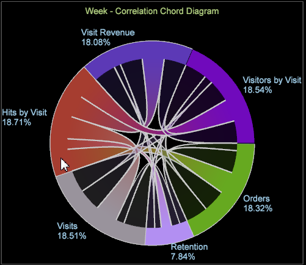

# 和諧視覺化{#chord-visualization}

「和弦」視覺化可讓您顯示量度之間的比例和關聯，顯示較大的和弦，以表示關聯性更強。

Chord視覺化可讓您查看量度之間的關聯，讓您新增並輕鬆評估可能的關聯。 它也提供任何先前建立之關聯矩陣的另 [一檢視](https://docs.adobe.com/content/help/en/data-workbench/using/client/analysis-visualizations/correlation-analysis/c-correlation-analysis.html)。 使用Chord視覺化，您無法識別量度之間的正或負關聯，只有關聯存在。 在某些情況下，可透過套用計數器度量來識別直接或反向關係。

1. **開啟視覺&#x200B;**[!UICONTROL Chord]**化**。

   在工作區中，以滑鼠右鍵按一下 [!DNL Visualization > Predictive Analytics > Chord]。

1. **從菜單中選擇一個維**。

   將會開啟空白的視覺化，讓您選取維度。 維度名稱會出現在空白和弦視覺化的頂端。

   >[!NOTE]
   >
   >如果您已在工作區中開啟「關聯矩陣」，您也可以將其呈現為「弦」視覺化。

1. **選擇要關聯的量度**。

   按一下將量 **[!UICONTROL Finder]** 度從表 **[!UICONTROL Ctrl-Alt]** 格拖曳至圖表，從拖曳量度。 在選取兩個或多個度量後，圖表會自動重新整理並開始顯示關聯資料。 視需要繼續新增量度以關聯資料點。

   

   「弦」視覺化會顯示每個區段的面積所代表的整體比例。 視需要繼續新增量度，以識別並調查重要關係。

   

1. **檢視Chord視覺化**。

   將滑鼠指標暫留在視覺化中的每個量度上，即可查看關係。 在範例中，您可以看到「件數」與大部分其他量度(「瀏覽持續時間」量度 **除外** )之間的關聯。

   

   當您將滑鼠指標暫留在 **Chord視覺化的「瀏覽持續時間** 」度量上時，您會發現所有其他度量之間幾乎沒有或最微弱的關聯。

   

1. **變更設定.** 以滑鼠右鍵按一下「弦」視覺化開啟選單以變更維度、以絕對數字或百分比顯示維度、移除選取的量度或所有量度、編輯顏色和詳細資料，以及將值匯出至關聯矩陣。

   

