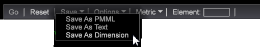

# 建立決策樹{#building-a-decision-tree}

{{eol}}

透過識別正面案例並新增量度和維度輸入來評估資料並探索決策樹，來設定決策樹。

請依照下列步驟建立決策樹。

1. 開啟新工作區。

   開啟新工作區後，您可能需要按一下 **新增** > **暫時解除鎖定**.

1. 若要開啟決策樹產生器，請按一下滑鼠右鍵 **[!UICONTROL Visualization]** > **預測性分析** > **分類** > **決策樹產生器**.

1. 設定 **正面案例**.

   您可以在尋找器中選取維度或表格中的維度元素，或在設計篩選器中設計篩選器，以定義決策樹的正大小寫。 事實上，正面案例可能是工作區中多個選取項目的組合，包括篩選器、維度、元素和所有類型的Data Workbench視覺效果值。

   * **設計和套用篩選器** 是正面案例。 在工作區中按一下滑鼠右鍵，然後選取 **[!UICONTROL Tools]** > **[!UICONTROL Filter Editor]** 來設計和套用篩選器。

   * 新增 **Dimension** 是正面案例。 在工作區中，按一下滑鼠右鍵並選取 **工具** > **搜尋器** （或選取） **[!UICONTROL Add]** > **[!UICONTROL Finders]** )。 在 **搜尋** 欄位，然後選取維度。

   * 新增 **量度** 是正面案例。 按一下滑鼠右鍵並選取 **工具** > **搜尋器** 或選取 **[!UICONTROL Add]** > **[!UICONTROL Finders]** 以開啟「度量」表格。 選取量度作為正面案例。

   * 新增 **Dimension元素** 是正面案例。 在工作區中按一下滑鼠右鍵，然後選取 **[!UICONTROL Table]** 若要開啟維度元素，請從維度元素中選取以設定正面大小寫。

1. 按一下 **[!UICONTROL Options]** > **[!UICONTROL Set Positive Case]**.

   這會設定正面大小寫，並讓您命名它。 名稱會顯示在 **[!UICONTROL Positive Case]** 標題。

   >[!NOTE]
   >
   >當您設定正面案例時，決策樹會使用目前工作區選取項目，可定義為符合工作區中目前選取項目的訪客（或任何已定義的頂層可數項目，但在大多數情況下為訪客）。 這些組合會合併為單一正大小寫的單一篩選（而非多個正大小寫）。

   按一下 **[!UICONTROL Set Positive Case]** 如果沒有選取，則會清除正面案例。

1. （可選）選取 **[!UICONTROL Set Population Filters]** 來定義要分類的訪客母體。

   如果未套用人口篩選，則會從所有訪客中提取訓練集（預設為「每個人」）。

   >[!NOTE]
   >
   >按一下 **[!UICONTROL Show Complex Filter Description]** 查看正大小寫和填充篩選的篩選指令碼。

1. 新增 **量度**, **Dimension**，和 **Dimension元素** 作為輸入。

   您可以從搜尋器面板或個別維度元素的表格拖放來選取輸入。 您也可以從 **[!UICONTROL Metrics]** 的雙曲餘切值。

   * 新增 **量度** 作為輸入。

      從工具列選取量度。 Press **Ctrl** + **Alt** 拖曳一或多個量度至決策樹產生器。

      量度會顯示在 **輸入（量度）清單** 作為輸入，使用唯一的顏色編碼。

      

   * 新增 **Dimension** 作為輸入。

      在工作區中，按一下滑鼠右鍵並選取 **工具** > **搜尋器** 並在 **搜尋** 欄位。 Press **Ctrl** + **Alt**，請選取維度，然後將維度拖曳至決策樹產生器。

      維度會顯示在 **輸入(Dimension)** 清單，使用唯一的顏色編碼。

   * 新增 **Dimension元素** 作為輸入。

      在工作區中，按一下滑鼠右鍵並選取Dimension表格。 選取Dimension元素，按 **Ctrl** + **Alt**，並將選取的元素拖曳至決策樹產生器。

      維度元素會顯示在 **輸入（元素）** 清單，使用唯一的顏色編碼。
   >[!IMPORTANT]
   >
   >最多可以選擇14個要評估的輸入。 如果新增太多輸入，則會顯示錯誤訊息。

1. 選擇 **[!UICONTROL Go]** 的上界。

   決策樹將根據選取的維度和量度建立。 購物車新增等簡單量度會快速建立，而具有多個資料點的造訪期間等複雜維度則會建立得更慢，且轉換時會顯示完成百分比。 然後，樹狀圖會修剪並開啟，供使用者互動使用。 維度和量度輸入會以色彩標示，與節點名稱一致。

   

   如果樹已剪下，且有預測，則葉節點顯示為綠色(true)或紅色(false) **True** 或 **False** 在剪枝後。

   >[!NOTE]
   >
   >從資料集提取訓練範例，供樹狀產生器使用。 Data Workbench使用80%的樣本來建立樹，其餘20%用於評估樹模型的準確性。

1. 使用 **[!UICONTROL Confusion Matrix]**.

   按一下 **[!UICONTROL Options]** > **[!UICONTROL Confusion Matrix]** 查看「正確性」、「召回率」、「精確度」和「F分數」值。 接近100%越好。

   「混淆矩陣」使用值的組合提供模型的四種準確度計數：

   * 實際正數(AP)
   * 預計正數(PP)
   * 實際負數(AN)
   * 預計負數(PN)

   >[!TIP]
   >
   >通過應用20%測試資料的最終評分模型來獲取這些數字，該模型已被預留，並且已被稱為真實答案。 如果分數大於50%，則會預測為正面大小寫（符合定義的篩選）。 然後，準確度=(TP + TN)/(TP + FP + TN + FN)，召回率= TP /(TP + FN)，精度= TP /(TP + FP)。

1. **探索決策樹**.

   產生決策樹後，您可以檢視預測的路徑，並識別符合定義准則的所有訪客。 該樹基於每個分支的位置和顏色編碼來識別每個分支的輸入拆分。 例如，如果您選取「反向連結網域」節點，導向該分割的節點會依樹狀結構左側的色彩代碼列出。

   您可以選取葉節點，以選取決策樹的分支（規則集）。

   在此範例中：如果造訪期間小於1，則不存在促銷活動、至少存在一個頁面檢視、沒有電子郵件註冊，且至少有一次造訪。 對此符合標準和下訂單的預測是 **94.73** 百分比。

   

   **決策樹交互**:可以使用標準 **按住Ctrl鍵並按一下** 要新增，或 **按住Shift鍵並按一下** 刪除。

   **色彩編碼節點**:節點的顏色與輸入維度和量度的顏色匹配，如Data Workbench所指定。

   剪下的分支葉級的亮綠色和紅色節點將節點預測為True或False。

   |  亮綠色 | 識別節點等於true，且符合所有條件。 |
   |---|---|
   |  亮紅 | 識別節點等於false，而非所有條件都符合。 |

1. **保存決策樹**.

   您可以以不同格式保存決策樹：

   

   * 預測標籤語言(**PMML**)，一種基於XML的檔案格式，供應用程式描述和交換決策樹模型。
   * **文字** 顯示簡單的列和行，包括true或false、百分比、成員數和輸入值。
   * A **Dimension** 與預測結果元素對應的分支。
