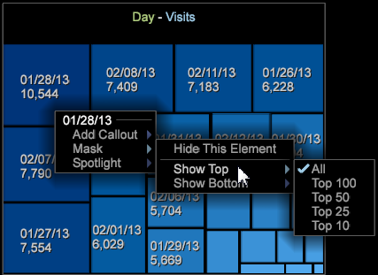

# 密度圖{#density-map}

密度圖視覺化會將元素顯示為方形圖中的陰影矩形。

矩形的大小取決於元素值，其中較大的值由較大面積的矩形表示。 類似圓形圖，此視覺化功能可讓您快速查看哪些元素在選取的維度中佔最大比例。

要建立密度圖，請執行以下操作：

1. 開啟新工作區。

   在開啟新工作區後，您可能需要按一下「新增 **>暫** 時解除鎖定 ****」。
1. 按一下 **[!UICONTROL Visualization]** > **[!UICONTROL Density Map]**.

1. Select a **[!UICONTROL Dimension]** from the menu.

   例如，選取 **[!UICONTROL Time]** > **[!UICONTROL Days]**。

   相反地，選取 **[!UICONTROL Time]** >可 **[!UICONTROL Hours]** 為您提供更多值較小的元素，顯示為較小的矩形。

   >[!NOTE]
   >
   >您會想要根據需求選擇包含多個元素的維度。 每個維度的目前限制為200個最大元素。

1. 您可以開啟>並從表格中選 **[!UICONTROL Visualization]** 取要 **[!UICONTROL Table]** 顯示在地圖中的元素，以變更維度檢視。

   

   地圖會回應表格中的選取項目。

1. 將滑鼠暫留在小元素上時，會在滑鼠游標附近出現的文字中顯示其名稱和值。
1. 以滑鼠右鍵按一下並選取，然 **[!UICONTROL Mask]**&#x200B;後選擇選項來遮色元素。

   

   要顯示所有被遮罩的節點，請選擇 **[!UICONTROL Unhide All]**。

1. 以滑鼠右鍵按一下並選取精選元素 **[!UICONTROL Spotlight]**，然後選擇選項。 精選功能可讓您反白標示和調暗範圍中的元素。
1. 新增顏色圖例至工作區。 您可以使用顏色圖例來識別地圖中的值。

   您可以將顏色圖例添加到工作區，節點將根據其他資料維更改顏色。
1. 以滑鼠右鍵按一下對應標題並從功能表選取，以變更維度或量度。

   

1. 以滑鼠右鍵按一下儲存格並選取，即可新增註解 **[!UICONTROL Add Callout]**。 您可以從功能表中選取不同類型或視覺化。

   

1. 和所有視覺化一樣，您可以在標題列上方按一下滑鼠右鍵，以顯示「關閉」、「儲存」、「匯出至Microsoft Excel」、「訂購」、「複製」、「最小化」和「無邊框」等基本指令，以顯示沒有邊框的視覺化。

   

1. 「密度圖」可讓您選取和取消選取多個類似其他視覺化的元素：

* 左鍵按一下以選擇元素。
* 按住Ctrl鍵並按一下以選取多個元素。
* 按住Shift鍵並按一下可取消選取元素。
* 在選取的元素內按一下滑鼠右鍵，以開啟選單。 然後選擇 **[!UICONTROL Deselect]** 或清 **[!UICONTROL Deselect All]** 除選定的元素。

## 其他選項 {#section-d77defb012424de4a7ced8e5c93115bc}

按一下右鍵「密度圖」以開啟包含以下選項的菜單：

<table id="table_3ADA85031C834792BFD041E186962A41"> 
 <thead> 
  <tr> 
   <th colname="col1" class="entry"> 選項 </th> 
   <th colname="col2" class="entry"> 說明 </th> 
  </tr>
 </thead>
 <tbody> 
  <tr> 
   <td colname="col1"> 新增 圖說 </td> 
   <td colname="col2">在視覺化中新增文字或圖形做為圖說，以進一步識別或描述元素。 
您也可以根據「密度圖」中選取的元素，選取空白的「量度圖例」、「表格」、「線圖」或「散布圖」。 然後，您可以視需要將度量和維度新增至這些空白視覺化。 
 </td> 
  </tr> 
  <tr> 
   <td colname="col1"> 遮色片 </td> 
   <td colname="col2">遮色片選項可讓您隱藏選取的元素。 按一下右鍵以顯示「蒙版」選項。 
 隱藏此元素(Hide This Element)-選擇此選項可遮蔽已選取的單個元素。 
 
 隱藏選定項(Hide Selected)-選擇此選項可遮罩已選取的多個元素。 
 
 顯示頂部— 選擇此選項，根據「密度圖」中的值，只顯示前100、50、25或10個頂層元素。 
 
 顯示底部(Show Bottom)-選擇此選項，根據「密度圖」中的值，只顯示底部100、50、25或10個頂部元素。 
 </td> 
  </tr> 
  <tr> 
   <td colname="col1"> 精選 </td> 
   <td colname="col2"> 精選功能可讓您反白標示和調暗範圍中的元素。 按一下滑鼠右鍵以開啟選項選單。 
 顯示頂部— 選擇此選項，根據「密度圖」中的值，僅反白標示前100、50、25或10個頂層元素。 
 
 顯示底部(Show Bottom)-選擇此選項，根據「密度圖」中的值，僅突出顯示底部100、50、25或10個頂部元素。 
 </td> 
  </tr> 
  <tr> 
   <td colname="col1"> 
取消選擇 
 
取消選擇全部 
 </td> 
   <td colname="col2"> 
 選擇這些命令以取消選擇當前元素（如果選中），或取消選擇所有選定元素。 
 </td> 
  </tr> 
 </tbody> 
</table>

