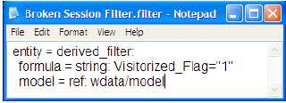

# 手動編輯篩選器檔案{#edit-filter-files-manually}

{{eol}}

手動編輯.filter檔案的步驟。

1. 在 [!DNL Profile Manager]，按一下 **[!UICONTROL Filters]**，然後找出您要編輯的檔案。
1. 如果檔案位於伺服器上，請以滑鼠右鍵按一下篩選器名稱旁適當欄中的核取記號，然後按一下 **[!UICONTROL Make Local]**.
1. 以滑鼠右鍵按一下 [!DNL User] 欄，按一下 **[!UICONTROL Open]** > **[!UICONTROL in Notepad]**. 此 [!DNL .filter] 檔案開啟。

   

1. 視需要編輯檔案。 如需定義篩選器時要使用的語法，請參閱 [篩選器運算式的語法](../../../../home/c-get-started/c-qry-lang-syntx/c-syntx-fltr-exp.md#concept-72f2563f809747a2a3cff7ec72462a15).
