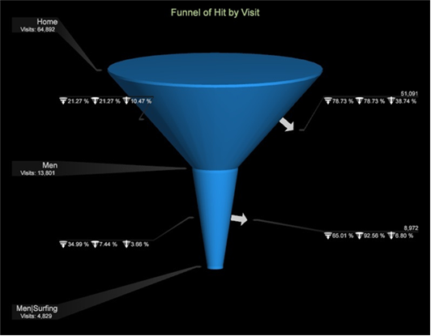

# 漏斗視覺效果{#funnel-visualization}

漏斗視覺化可讓您識別客戶在與您的網站或跨通道促銷活動互動時，客戶在何處放棄行銷促銷活動或從定義的轉換路徑轉向。

漏斗視覺化可識別將頁面檢視轉換為購買，並讓您瞭解客戶在流程中流失的地方。 在每個步驟中洞悉客戶決策，讓您瞭解他們被嚇住的地方、他們傾向遵循的路徑，以及客戶何時離開您的網站及前往何處。

正確瞭解客戶導覽可讓架構設計人員根據趨勢興趣來設計和定位網頁，並讓行銷人員更能針對特定促銷活動來解讀客戶行動和互動。

## 關於漏斗{#section-bf0ee36bb8ce47ec910ca23629e7c53a}

漏斗視覺化與路徑瀏覽器建立路徑來分析訪客的點擊順序、識別流失者（誰離開路徑）或流失者（誰跟隨路徑）的方式非常相似。 它還可識別訪客在沿著促銷活動路徑進行每個步驟後前往的位置，以及在離開或落入已定義步驟後導覽至的位置。

除了Web資料外，您還可以跨平台支援的所有跨通道資料類型執行漏斗分析。 來自任何來源的任何資料元素都可以在漏斗視覺化中呈現。

漏斗視覺化提供各種資料層級：

* **[!UICONTROL Funnel by Visit]**。此漏斗是以「每次瀏覽」互動為基礎。
* **[!UICONTROL Funnel by Visitor]**。此漏斗是以「每位訪客」互動為基礎。 此檢視會根據訪客組織的瀏覽顯示資料。
* **Clip**&#x200B;維和&#x200B;**Level**&#x200B;維。 漏斗維度可透過選擇「點進」、「點擊」、「產品」、「瀏覽」或「訪客層級」維度來修改。

* **量度**. 您可以將用於建立漏斗的瀏覽次數，變更為描述檔中的任何度量，以便將基礎的漏斗度量變更為。 「漏斗」視覺化可讓您深入鑽研資料，並透過多個基線度量分析訪客的模式。

>[!NOTE]
>
>在漏斗視覺化中，您可以在可計數層級套用任何維度。 這與限制您選擇量度的路徑瀏覽器和流程地圖形成對比。 在漏斗視覺化中套用量度時，分析師有多種選擇。
