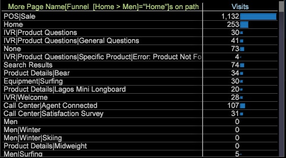

# 新增路徑瀏覽器{#adding-a-path-browser}

從漏斗視覺效果中，您可以開啟「路徑瀏覽器」，以識別其他詳細的訪客流失和流過的路徑。

<!--  -->

您可以識別訪客的「流失」位置（離開路徑的人）或訪客的「流失」位置（遵循路徑的人）。 您可以選取流失箭頭或透過錐體來從相同的漏斗視覺效果開啟多個路徑瀏覽器。

1. 開啟流失訪客的路徑瀏覽器，即在特定步驟離開網站的訪客。 以滑鼠右鍵按一下流失箭頭，然後選取新增路徑瀏覽器選項。

   

   從路徑瀏覽器，您可以查看訪客在點擊漏斗中選取的元素前瀏覽的位置（位於左側），以及離開頁面後導覽至的位置（位於右側）。

   

   在「路徑瀏覽器」視覺效果中，進出所選維度的線條寬度可識別流量。 例如，在點擊「男性」頁面之前，有些訪客是透過其他路線進入，但大部分是透過首頁進入。 離開時，大部分人都去了「男性衝浪」頁面。

1. 開啟「落體」訪客的路徑瀏覽器。 以滑鼠右鍵按一下漏斗中的錐體，以識別漏斗中穿過或移至下一個步驟的訪客的路徑。
1. 按一下「路徑瀏覽器」視覺效果底部的&#x200B;**更多**&#x200B;按鈕，開啟一個表格，其中列出前次造訪和目前造訪的所有造訪都以表格檢視列出。

   
