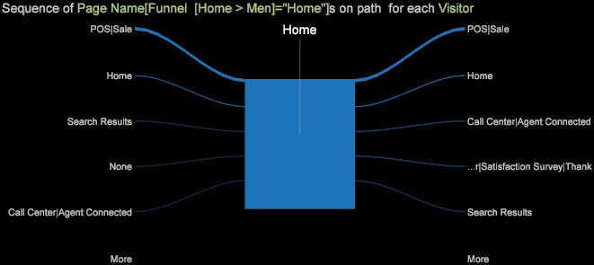

# 新增路徑瀏覽器{#adding-a-path-browser}

從「漏斗」視覺化中，您可以開啟「路徑瀏覽器」，以識別其他詳細的訪客流失並逐步瀏覽路徑。

<!--  -->

您可以識別訪客「流失」（離開路徑）或訪客「流失」（跟隨路徑）的位置。 您可以從相同的漏斗視覺化中，選取流失箭頭或落在圓錐體，以開啟多個路徑瀏覽器。

1. 開啟流失訪客的路徑瀏覽器，即在特定步驟中離開網站的訪客。 以滑鼠右鍵按一下流失箭頭，然後選取「新增路徑瀏覽器」選項。

   

   從「路徑瀏覽器」中，您可以看到訪客在點擊漏斗中的選定元素之前所前往的位置（在左側），以及訪客離開頁面後瀏覽的位置（在右側）。

   

   在「路徑瀏覽器」視覺化中，進出選定維度的線條寬度會識別流量。 例如，在點擊「男性」頁面之前，有幾位訪客透過其他路由進入，但大部分訪客是透過「首頁」進入。 離開時，大部分人都去了「男人衝浪」頁面。

1. 為「落體」訪客開啟路徑瀏覽器。 在漏斗中按一下滑鼠右鍵，以識別漏斗中跌過或移至下一步的訪客的路徑。
1. 按一下「路徑瀏覽器」視覺化底部的&#x200B;**更多**&#x200B;按鈕，以開啟表格式檢視中列出的表格，顯示先前和目前瀏覽的所有瀏覽。

   
