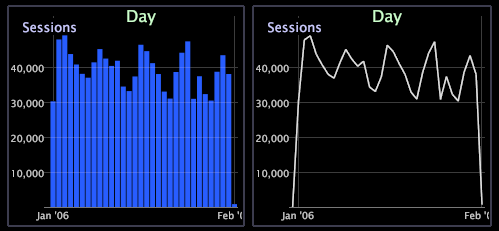

# 變更圖形顯示{#change-a-graph-display}

依預設，圖表視覺化會顯示列，但您可輕鬆將列顯示為線，反之亦然。

以下示例顯示了兩種顯示類型。

**要選擇顯示類型**

按一下右鍵圖形底部的尺寸標籤，然後按一下 **[!UICONTROL Display]** > **[!UICONTROL Draw lines]** 或 **[!UICONTROL Display]** > **[!UICONTROL Draw bars]**。 活動顯示模式的左側出現X。

**圖形上的漸層覆蓋**

您可以按一下滑鼠右鍵，然後從選單中選 **取「漸層覆蓋** 」，以更佳地檢視圖形元素。

* **無漸層覆蓋**。 選取以顯示未套用漸層覆蓋的橫條。
* **左側背景**。 選擇此選項可顯示從左到右所有條的顏色漸變。
* **右側背景**。 選擇此選項可顯示從右到左所有條的顏色漸變。
* **圓柱體**。 選擇以顯示顏色漸變（從每個條的中心到每個條的邊緣）。

