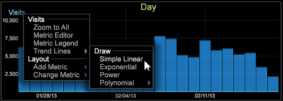

# 趨勢線{#trend-lines}

{{eol}}

趨勢線可讓您覆蓋圖形以比較和解讀資料。

贊 [散布圖](https://experienceleague.adobe.com/docs/data-workbench/using/client/analysis-visualizations/c-scat-plots.html) 視覺效果中，您現在可以在圖形視覺效果上設定趨勢線，以根據線性、指數、冪或多項式線顯示變更率。 趨勢線功能可讓您在圖形上覆蓋趨勢線，最常是在時間維度上。

例如，在此圖表比較中，我們可以看到造訪呈上升趨勢，但訂單呈下降趨勢。

新增趨勢線的方式

1. 開啟圖表，然後以滑鼠右鍵按一下左上角的量度名稱。
1. 按一下 **[!UICONTROL Trend Lines]** ，然後從選項中選取。

   

   您可以選取趨勢線，以在圖形上顯示為 **簡單線性**, **指數**, **電源**，或 **多項式**. 多項式將建立多項式回歸趨勢線。 簡單線性將建立趨勢線作為沿著回歸線的變化率。 指數會以y = b計算趨勢線&#42;exp(a&#42;x)和Power as y = b&#42;x`a`.

   趨勢將在圖形上計算和呈現，並且標注將開啟，顯示趨勢方程式的詳細資訊。

   
