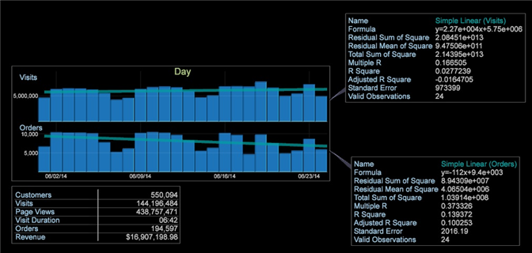

# 趨勢線{#trend-lines}

趨勢線可讓您覆蓋圖形以比較和解譯資料。

和散布圖 [視覺化一樣](https://docs.adobe.com/content/help/en/data-workbench/using/client/analysis-visualizations/c-scat-plots.html) ，您現在可以在圖形視覺化上設定趨勢線，以根據線性、指數、冪或多項式線來顯示變更率。 「趨勢線」功能可讓您覆蓋圖形上的趨勢線，最常覆蓋時間維度。

例如，在此圖表比較中，我們可以看到「瀏覽」趨勢向上，但「訂購」趨勢向下。

若要新增趨勢線

1. 開啟圖表，並在左上角按一下量度名稱。
1. 按一 **[!UICONTROL Trend Lines]** 下並從選項中選取。

   

   可以選擇趨勢線，以在圖形上顯示為 **簡單線性**、指數 **、**&#x200B;功率 **或多******&#x200B;項式。 多項式會建立多項式回歸趨勢線。 「簡單線性」會建立趨勢線，作為沿著回歸線的變化率。 指數型計算趨勢線的值為y = b*exp(a*x)，冪的值為y = b*x`a`。

   趨勢將會在圖形上計算並轉換，而圖說會開啟，顯示趨勢方程式的詳細資訊。

   

