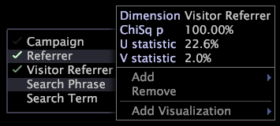

# 顯示「維度」功能表{#display-the-dimension-menu}

{{eol}}

顯示維資訊或選項的步驟。

1. 在引導式分析視覺效果中，以滑鼠右鍵按一下維度名稱。

   

   >[!NOTE]
   >
   >如果維度名稱以紅色顯示，資料集中並未定義該名稱。

1. 檢視維度的相關統計資訊，如本節前面所述。
1. （選用）按一下下列其中一個選項：

   * **[!UICONTROL Add]** 添加其他維。
   * **[!UICONTROL Remove]** 刪除選定的維。
   * **[!UICONTROL Add Visualization]** 為選取的維度新增視覺效果。
