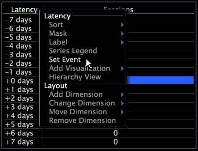

# 延遲表{#latency-tables}

延遲表格視覺化是包含延遲維度的表格，延遲維度是一種衍生維度，可測量自特定事件發生後經過的時間。

您可以在一個或多個視覺化中進行選取，並使用「設定事件」內容選單選項將選取的項目設定為事件，以定義事件。 延遲表格對於追蹤與促銷活動或您尋找時間關聯的特定客戶順序相關的活動特別有用。

在中， [!DNL Site]延遲表格會提供有關事件前或之後多達7天所發生之訪客作業的資訊，但您可以設定延遲表格，以提供有關不同可計數維度和時間維度的資訊。 請參 [閱配置延遲表](../../../home/c-get-started/c-intf-anlys-ftrs/c-config-ltcy-tbls/c-config-ltcy-tbls.md#concept-7175c3defec64556994f0dfcccb7d15c)。

父維度的元素（例如作業）是您選取之特定事件的一部分，延遲為零。 所有其他元素都會指派反映與事件距離（在適當時間維度中）的延遲。

以下示例說明了如何使用延遲表。

**識別與促銷活動相關的值事件**

假設您想要追蹤客戶在回應特定廣告促銷活動前後七天內的活動。 若要檢視特定廣告促銷活動的延遲，您應將感興趣的促銷活動設定為延遲表格的事件。

下方工作區的延遲是根據「促銷活動11566」（回應此促銷活動的工作階段）的選擇。

延遲&quot;+0天&quot;可識別回應Campaign 11566的工作階段，以及同一天發生的相同客戶的所有其他工作階段。

延遲「-2天」可識別在客戶回應促銷活動前兩天，針對相同客戶進行的工作階段。

延遲&quot;+7天&quot;可識別在回應促銷活動七天後，針對相同客戶進行的工作階段。

除了下列章節中列出的程式外，您還可以執行表格中可執行的所有相同任務，例如排序元素、遮色片元素、新增系列圖例、匯出資料等。 For more information, see [Tables](../../../home/c-get-started/c-analysis-vis/c-tables/c-tables.md#concept-c632cb8ad9724f90ac5c294d52ae667f).

## 建立延遲表 {#section-31a03031d9854ef7acc2462d4f37678d}

要建立延遲表，首先要進行選擇，然後將該選擇設定為要跟蹤延遲的事件。

1. 在工作區中按一下滑鼠右鍵，並開啟所要的視覺化，這必須以用來設定延遲表格的可計數維度為基礎。

   例如，在 [!DNL Site] 視覺化中，需要以作業為基礎。

1. 開啟空白的延遲表格。
1. 在工作區中進行選取。
1. 在延遲表內按一下右鍵，然後按一下 **[!UICONTROL Set Event]**。

>[!NOTE]
>
>除非將選取的項目儲存為延遲維度，否則您選取的事件不會持續存在。 如需步驟，請參 [閱重複使用延遲維度](../../../home/c-get-started/c-analysis-vis/c-lat-tbls.md#section-29c6483bf9ba476fb1c24ad1df253f46)。

## 重複使用延遲表 {#section-05f741169d204213b6537dce553e4f73}

如果您想再次使用相同的延遲表，可以將延遲表保存在本地，或者如果您具有適當的權限，可以將其保存到伺服器，以便特定配置檔案的所有用戶訪問。

**要保存延遲表以用於其他工作區**

1. 以滑鼠右鍵按一下視覺化的上邊框，然後按一下 **[!UICONTROL Save]**。 出現 [!DNL Save] 窗口。 預設的保存位置是User\*profile name*\Work資料夾。
1. 在欄位 [!DNL File name] 中，輸入視覺化的描述性名稱，然後按一下 **[!UICONTROL Save]**。

**要檢索保存的延遲表**

1. 在工作區中按一下滑鼠右鍵，然後按一 **[!UICONTROL Open]** 下> **[!UICONTROL File]**。 出現 [!DNL Open Visualization] 窗口。
1. 導覽至您儲存的延遲表格。
1. 選擇延遲表可視化檔案( [!DNL *.vw])並按一下 **[!UICONTROL Open]**。

## 重複使用延遲維度 {#section-29c6483bf9ba476fb1c24ad1df253f46}

如果您想再次使用相同的延遲維度，可以將延遲維度儲存在本機，或者如果您擁有適當的權限，可以將其儲存至伺服器，讓特定描述檔的所有使用者都能存取。

您建立的任何延遲維度都會儲存在描述檔的「維度」目錄中，並可在「資料工作台」 [!DNL Change Dimension] 的下拉式清單中使用。

**要保存延遲維以便用於其他工作區**

1. 按一下右鍵列標 [!DNL Latency] 簽或其中一個元素，然後按一下 **[!UICONTROL Save Dimension]**。 出現 [!DNL Save Dimension As] 窗口。
1. 在「維」(Dimensions)目錄中選擇或建立相應的子目錄。
1. 在欄位 [!DNL File name] 中，輸入維度的描述性名稱(例如， [!DNL Latency for Campaign 11565.dim])，然後按一下 **[!UICONTROL Save]**。

**要檢索保存的延遲維**

1. 在工作區中按一下滑鼠右鍵，然後按一 **[!UICONTROL Open]** 下> **[!UICONTROL File]**。 出現 [!DNL Open Visualization] 窗口。
1. 導覽至您儲存在「使用者*描述檔名稱*\維度」檔案夾中的延遲視覺化。
1. 選擇延遲維檔案( [!DNL *.dim])並按一下 **[!UICONTROL Open]**。

## 匯出至Microsoft Excel {#section-3dffa5c3aab14cdaa40c78b81b08fe53}

有關導出窗口的資訊，請參 [閱導出窗口資料](../../../home/c-get-started/c-wk-win-wksp/c-exp-win-data.md#concept-8df61d64ed434cc5a499023c44197349)。

## 匯出至TSV檔案 {#section-fd921f351c994ed0a94f63d3bd5b5a87}

有關導出窗口的資訊，請參 [閱導出窗口資料](../../../home/c-get-started/c-wk-win-wksp/c-exp-win-data.md#concept-8df61d64ed434cc5a499023c44197349)。
