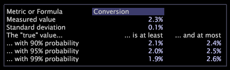

# 信賴度圖例{#confidence-legends}

{{eol}}

信賴圖例可協助您判斷您看到的數字是偶然發生的機率，並了解資料中可能的偏差。

即使不是採樣資料，也不能將數字從特定時段或子集外推到具有完全置信度的其他時段或子集。 可信度圖例可讓您探索數字落在特定範圍內的可能性。

如果你把現實世界的資料看作是一個大實驗，那麼真實世界仍然有機會，即使用精確的數字。 例如，知道在一個星期二上午8點到下午12點之間完成交易的人數並不意味著在接下來的星期二會完成同樣的數目。

下列信賴圖例會顯示轉換量度的信賴詳細資料，而下表則提供各資料點所代表之意義的詳細資訊。

<table id="table_387F22C7EF4E4DE9AD810D3D9204676F"> 
 <thead> 
  <tr> 
   <th colname="col1" class="entry"> 欄位 </th> 
   <th colname="col2" class="entry"> 說明 </th> 
  </tr> 
 </thead>
 <tbody> 
  <tr> 
   <td colname="col1"> 
量度或公式 
 </td> 
   <td colname="col2"> 
您要檢視信賴資訊的量度名稱或量度運算式。 您在工作區中所做的任何選取都會反映在圖例中。 此範例顯示轉換量度的詳細資訊。 
 
如需輸入運算式的語法規則相關資訊，請參閱 <a href="../../../../home/c-get-started/c-qry-lang-syntx/c-qry-lang-syntx.md#concept-15d1d3f5164a47d49468c5acb7299d9f"> 查詢語言語法</a>. 
 </td> 
  </tr> 
  <tr> 
   <td colname="col1"> 
測量值 
 </td> 
   <td colname="col2"> 
實際收集資料的值。 在此範例中，目前選取項目的轉換率為2.3%。 
 </td> 
  </tr> 
  <tr> 
   <td colname="col1"> 
標準差 
 </td> 
   <td colname="col2"> 
測量值的標準差。 在此範例中，目前選擇之轉換率的標準差為0.1%。 
 </td> 
  </tr> 
  <tr> 
   <td colname="col1"> 
「true」值 
 </td> 
   <td colname="col2"> 
「測量值」落在每個機率所列範圍內的可能性。 在此範例中，如果這個「真實世界實驗」一再重複，您可以90%確定「測量值」在2.1%和2.4%之間。 
 </td> 
  </tr> 
 </tbody> 
</table>

>[!NOTE]
>
>分析任何計算結果時，您必須考慮下列警告：
>* 數字是估計值。 如果您對不同的資料集重複相同的計算，得到的結果會不同。 這稱為隨機變異。
>* 對高概率的外推取決於對所有指標來說都不正確的常態假設。 因此，99%概率的值比90%概率的值不可靠。
>
>如果您需要更準確的數字，應咨詢統計專家。

## 變更量度或公式 {#section-7f09ff84c3514f26b78d29294e1f03d9}

* 在信賴圖例中，按一下 **[!UICONTROL Metric or Formula]** 欄位並輸入所需的量度或運算式。 如需運算式語法規則，請參閱 [查詢語言語法](../../../../home/c-get-started/c-qry-lang-syntx/c-qry-lang-syntx.md#concept-15d1d3f5164a47d49468c5acb7299d9f).

## 匯出至 Microsoft Excel {#section-f36e2db7273740b7af278f8a2b79d564}

有關導出窗口的資訊，請參見 [導出窗口資料](../../../../home/c-get-started/c-wk-win-wksp/c-exp-win-data.md#concept-8df61d64ed434cc5a499023c44197349).
