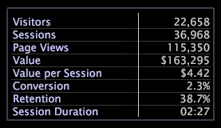

# 量度圖例{#metric-legends}

量度圖例可讓您查看與您的設定檔相關的基準量度，以及與資料集相關的統計資料(或是與目前選取範圍相關的基準量度（如果已選取）。

Adobe應用程式中的量度圖例會顯示與資料集相關的量度，如下列[!DNL Site]量度圖例中。

量度圖例實際上是表格視覺化的特例。 因此，表格可用的功能與度量圖例相同。 請參閱[表](../../../../home/c-get-started/c-analysis-vis/c-tables/c-tables.md#concept-c632cb8ad9724f90ac5c294d52ae667f)。

## 新增量度{#section-6655470bf06c4d2b82f7a01784552d1e}

* 在量度圖例中，以滑鼠右鍵按一下量度名稱，然後按一下&#x200B;**[!UICONTROL Add Metric]** > ***[!UICONTROL metric name]**>*。

## 移除量度{#section-c0da3396b2d44b9b899b7a0e7d747d94}

* 在量度圖例中，以滑鼠右鍵按一下您要移除的量度名稱，然後按一下&#x200B;**[!UICONTROL Remove]**。

## 匯出至 Microsoft Excel {#section-03b07062fb43422c902ff65cb66bbd27}

有關導出窗口的資訊，請參見[導出窗口資料](../../../../home/c-get-started/c-wk-win-wksp/c-exp-win-data.md#concept-8df61d64ed434cc5a499023c44197349)。

## 匯出至 TSV 檔案 {#section-51a0a6f9cd05448caf149ddc927aa665}

有關導出窗口的資訊，請參見[導出窗口資料](../../../../home/c-get-started/c-wk-win-wksp/c-exp-win-data.md#concept-8df61d64ed434cc5a499023c44197349)。
