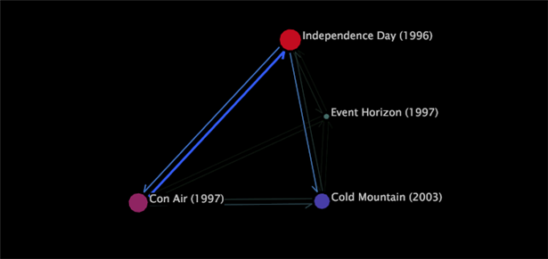

# 程序圖類型{#types-of-process-maps}

{{eol}}

關於不同類型的流程圖的資訊。

## 2D程式圖 {#section-ea7fbdb80b1b44aebcd9e4090b6540bf}

二維程式圖可提供維度元素之間活動的二維檢視。 2D進程圖中的節點大小與與該節點相關聯的度量值成比例。 此外，兩個節點之間的箭頭的厚度和強度都與這些節點的度量值平均值成正比。

在2D程式圖中，您可以執行下列任一作業：

* 選擇、移動、刪除和標籤節點
* 進行選取
* 儲存維度
* 建立其他視覺效果
* 啟用顏色連結
* 顯示量度數量
* 新增圖說文字

以下示例中的2D進程映射顯示與電影名稱對應的節點。 每個影片名稱都是「影片」維度的元素，定義於由影片資料組成的資料集中。 「影片」維是此進程映射的基本維。

在此範例中，每個節點的大小以及每個箭頭的厚度和強度都與「收視率」度量成比例，該度量是電影接收的收視率計數。 因此，具有大節點的電影，例如 *獨立日*，評等的評等比具有小節點的影片多，例如 *事件地平線*. 您也可以看到分級的電影觀看者更多 *獨立日* befor *冷山* 而不是按相反的順序對相同的電影進行分級。 請注意，箭頭並不表示檢視器已評分 *獨立日* 然後被分級 *冷山* 之後，或者相反。 觀眾可能已對其他影片進行了分級，但這些影片不會顯示在地圖上。

## 2D量度地圖 {#section-a9b846fc71224058918fbc378315effe}

二維量度圖是一種2D程式圖，可根據特定量度的值來定位節點。 在許多情況下，與2D量度對映搭配使用的量度為轉換或保留。 轉換和保留圖可協助您了解針對客戶的管道流程中的步驟會影響客戶轉換和保留。

>[!NOTE]
>
>搭配2D量度圖使用的量度必須以百分比表示。

在轉換量度圖中，轉換率為0%的節點會繪製在圖形的左側，轉換為100%的頁面會繪製在右側。 節點之間的活動會顯示出來，讓您輕鬆查看程式中哪些步驟導致轉換增加或減少，以及哪些步驟導致放棄。 流程轉換分析是比較流程或比較同一流程不同實施的有效方法。

同樣地，保留圖顯示圖表左側保留率為0%的元素，右側保留率為100%的元素。 您可以在地圖上看到每個節點的保留率，這可協助您判斷要傳回哪些元素會影響客戶。

>[!NOTE]
>
>無法水準移動2D度量映射上的節點。 量度圖的設計目的，是根據節點的量度值，從左到右定位節點。

## 3D工藝圖 {#section-80acb63ea0994af1af7faef3c6264e51}

三維流程圖提供維度元素之間活動的三維檢視。 3D進程圖中的條的高度與與該節點關聯的度量的值成比例。 與2D工藝圖一樣，兩個節點之間的連接器的厚度和強度都與這些節點的度量值平均值成正比。 在3D進程圖中，您可以執行下列任一任務：

* 選擇、移動、刪除和標籤節點
* 進行選取
* 儲存維度
* 建立其他視覺效果
* 啟用顏色連結

下列範例中的3D程式圖顯示與網站頁面對應的節點。 每個頁面都是「頁面」維度的元素，定義於由網頁流量資料組成的資料集中。 「頁面」維度是此程式圖的基本維度。

在此範例中，每個長條的高度以及每個連接器的厚度和強度與「工作階段」量度成比例，即檢視頁面的工作階段計數。 因此，在工作階段中檢視的長條圖為頁面（例如/faq/all/FAQ），會多於短條圖為頁面（例如/vs/demo）時檢視。 請注意，兩個頁面之間的連線並不表示在指定工作階段期間，某個頁面是在另一個頁面之前或之後立即檢視。 可能已在相同工作階段期間檢視過其他頁面，但這些頁面不會顯示在此地圖上。
