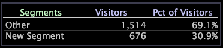

# 建立區段維度{#create-a-segment-dimensions}

若要建立區段維度，首先在工作區中進行選取，然後將區段新增至視覺化。

**若要建立區段維度**

1. 新增區段視覺化至工作區。 例如：

   

1. 將您要用來定義區段的視覺化新增至工作區，然後進行所需的選取以定義區段。
1. 在區段視覺化中，以滑鼠右鍵按一下區段的標籤，然後在標籤後方新增新區段，然後按一下 **[!UICONTROL Add Segment]**。

   >[!NOTE]
   >
   >若要建立新的第一個區段，請以滑鼠右鍵按一下標 **[!UICONTROL Segments]** 簽，然後按一下 **[!UICONTROL Add Segment]**。

   

   視覺化中會顯示新區段（名為「新區段」）。 「其他」區段代表所有未包含在您定義區段中的資料：這實際上是資料集資料與區段資料之間的差異。

1. 以滑鼠右鍵按一下新建立的區段，然後按一下 **[!UICONTROL Rename Segment]**。
1. 在名稱欄位中，為新區段輸入描述性名稱。

   >[!NOTE]
   >
   >如果量度值（例如中的特定訪客）符合多 [!DNL Site]個區段的標準，則量度值只會包含在符合的第一個列出區段中。

**若要儲存區段維度**

1. 以滑鼠右鍵按一下「區段」標籤，然後按一下 **[!UICONTROL Save Dimension]**。 出現 [!DNL Save Dimension As] 窗口。 預設的保存位置是User\*profile name*\Dimensions資料夾。
1. 在欄位 [!DNL File name] 中，輸入要儲存為維度之區段的描述性名稱，然後按一下 **[!UICONTROL Save]**。

每當您使用視覺化時，都可以存取區段維度。 您也可以使用區段匯出功能，匯出與儲存維度中元素相關的資料。

如需區段匯出功能的詳細資訊以及依您需求設定區段的指示，請參 [閱設定匯出區段](../../../../home/c-get-started/c-exp-data-seg-exp/t-config-sgts-expt.md#task-8857f221fa66463990ec9b60db6db372)。
