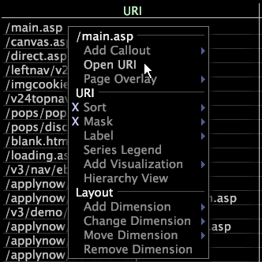

# 從表格開啟 URI{#open-a-uri-from-a-table}

當前僅在Site應用程式中配置了開啟功能，並且僅用於開啟URI。

請參閱[配置開啟功能](../../../../home/c-get-started/c-intf-anlys-ftrs/c-config-open-funct.md#concept-854e6dc8bef34e6aa4ccfb7a8929af4d)。

在[!DNL Site]中，可以從URI表中按一下右鍵URI以在Web瀏覽器中顯示網頁。 要以其本機格式（如HTML）查看URI,Data Workbench必須有權訪問引用的位置以及開啟該項目所需的應用程式。 例如，要查看網頁，Data Workbench必須具有對Internet的訪問權限並安裝Web瀏覽器。

* 以滑鼠右鍵按一下維度的元素，然後按一下&#x200B;**[!UICONTROL Open URI]**。

   

   URI在其本機應用程式中開啟。
