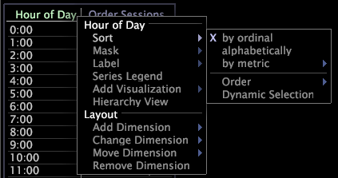

# 排序表格中的資料{#sort-data-in-a-table}

排序資料的步驟。

如果表格只有一個維度，您只需按一下您要排序資料之量度的標籤即可。

1. 按一下右鍵要排序的維的元素或標籤，然後按一下&#x200B;**[!UICONTROL Sort]**。

   

1. 按一下下列其中一個選項:

   * **[!UICONTROL By ordinal]** 來排序元素。例如，「小時」維度的元素會依時間順序顯示。 如果維度沒有自然順序，例如使用反向連結或URI，排序順序就不實用，因此您應選擇依字母順序或依量度排序。
   * **[!UICONTROL Alphabetically]** 按元素名稱的字母順序排序維。
   * **[!UICONTROL By metric]** ，以選擇您要依此方式排序資料的量度。例如，您可以依「工作階段」度量來排序「反向連結」維度，以查看哪些反向連結對您網站的工作階段貢獻最大。

      當您依量度排序時，依預設表格中的順序會與當時選取範圍所影響之量度值相對應。 如果您稍後更改選擇，則排序順序不會從原始順序更改，除非使用尺寸或啟用「動態選擇」。 按一下&#x200B;**[!UICONTROL Sort]** > **[!UICONTROL Dynamic Selection]**&#x200B;時，每次更改選擇時都會重複使用表。
   若要依表格中的現有量度排序，請按一下量度標籤。

1. （可選）若要選擇按升序或降序排序，請按一下右鍵要排序的維的元素或標籤，然後按一下&#x200B;**[!UICONTROL Sort]** > **[!UICONTROL Order]** > **[!UICONTROL Ascending]**&#x200B;或&#x200B;**[!UICONTROL Sort]** > **[!UICONTROL Order]** > **[!UICONTROL Descending]**。

   如果表格只有一個維度，您只需按一下量度的標籤，即可反轉排序順序。 再次按一下標籤會反轉排序順序。
