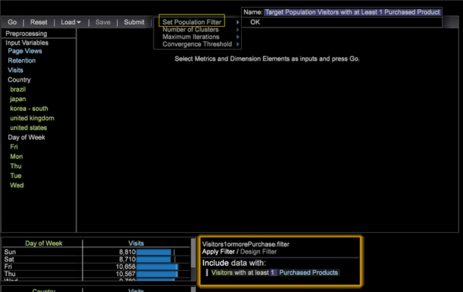
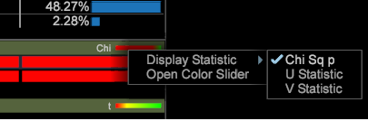

# 建立叢集{#building-clusters}

選取輸入變數、叢集數目和目標人口（如果需要），以定義資料集中的叢集。

**建立叢集**

1. 開啟 **[!UICONTROL Cluster Builder]**.

   按一下「**視覺化** > **預測分析** > **叢集** > **叢集產生器**」。

   

1. 選取輸入變數。

   * 從工具列的&#x200B;**[!UICONTROL Metric]**&#x200B;選單中選取，將量度新增至&#x200B;**[!UICONTROL Input Variables]**&#x200B;清單。

      

   * 將維元素從Dimension表中拖曳，將其添加到&#x200B;**[!UICONTROL Input Variables]**&#x200B;清單中。

      按&#x200B;**[!UICONTROL Ctrl + Alt]**&#x200B;鍵，將選定的維元素拖動到工具欄的&#x200B;**[!UICONTROL Input Variables]**&#x200B;清單或&#x200B;**[!UICONTROL Element]**&#x200B;框中。

      
   依預設，會在整個資料集上執行叢集。 您可以在左側的&#x200B;**[!UICONTROL Preprocessing]**&#x200B;窗格中看到所有輸入變數。
1. 使用&#x200B;**[!UICONTROL Options]**&#x200B;功能表來選擇所需的叢集數。

   

1. 如果您想要在資料集中叢集訪客的子集，可以定義人口篩選。

   

   首先，使用工作區中的選取項目或使用&#x200B;**[!UICONTROL Filter Editor]**&#x200B;來定義所需子集。 在您選取所需子集後，在&#x200B;**[!UICONTROL Options]**&#x200B;功能表中設定「目標人口」。 建議您為目標群組指定識別名稱。

   **[!UICONTROL Options]**&#x200B;菜單還設定了控制最大刀路數和中心收斂的可接受閾值的設定。

1. 在設定輸入和選項後，按一下&#x200B;**Go**&#x200B;按鈕，在本機執行叢集，或按&#x200B;**[!UICONTROL Submit]**&#x200B;將工作傳送至Predictive Analytics伺服器。 當收斂完成時，提交至伺服器會將產生的維度儲存至資料集。

   在本地運行時，您將看到Cluster Builder在四個樹冠叢集階段中移動，因為它根據輸入定義智慧中心。

   當群集的中心不再改變超過指定的收斂閾值時，群集Dimension便會收斂，而群集生成器會顯示有關輸入與每個群集的相關性的附加資訊。

1. 自訂叢集。

   在統計資料的色彩列上按一下滑鼠右鍵，可開啟內容選單，讓您自訂相關性臨界值，在維度元素分佈的情況下，選擇顯示的測試。

   

   度量輸入為每個群集提供t測試，而維度元素輸入則為每個群集提供三個分佈測試（Chi²、熵U統計值和Cramer的V統計值）。

   >[!NOTE]
   >
   >如果您在收斂期間新增或移除輸入，程式會暫停，直到您再次按&#x200B;**Go**。

   建立叢集後，您可以開啟檢色器，為不同的分佈結果指定顏色。

   

1. 在集群Dimension聚合後，您可以向表中添加度量，並正常進行選擇。 您也可以按一下右鍵元素名稱（群集1、群集2等）以開啟上下文菜單，將其更名為更有意義的內容。

   

1. 如果希望在其他視覺化中使用此群集維，可以在本地&#x200B;**[!UICONTROL Save]**&#x200B;將其使用，或將其用於伺服器。**[!UICONTROL Submit]**

如果您想要再次運行收斂或查看輸入的相關性，Cluster Builder也可以載入現有的群集維。

>[!TIP]
>
>選取後，**[!UICONTROL Reset]**&#x200B;將完全釋放所有輸入變數，並提供空白的叢集建立器視覺化來定義新叢集。
