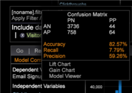

# 設定傾向得分{#setting-up-propensity-scoring}

請依照下列步驟，使用「傾向分數」視覺化。

1. 開啟新工作區，然後按一 **[!UICONTROL Add]** 下> **[!UICONTROL Visualization]** > **[!UICONTROL Predictive Analytics]** > **[!UICONTROL Scoring]** > **[!UICONTROL Propensity Score]**。

   

1. 設定( **[!UICONTROL Target]** 相依變數)。

   通過選擇：

* **維元素**:在工作區中按一下滑鼠右鍵，然後選取 **[!UICONTROL Table]**。 然後選取「維度」元素作為相依變數。

   或

* **[!UICONTROL Filter Editor]**。按一 **[!UICONTROL Add]** 下> **[!UICONTROL Visualization]** > **[!UICONTROL Filter Editor]** 以開啟「篩選編輯器」視覺化。

   

   選取「維」元素或「篩選」作為相依變數後，按一 **[!UICONTROL Set Target]**&#x200B;下，輸入名稱以說明相依變數。 然後按 **[!UICONTROL OK]** 一下（並確定篩選方塊已反白顯示）以設定Target。

   

   您為目標提供的名稱是將顯示在左側窗格中的從屬變數。
1. 新增獨立變數。

   使用量度或維度元素新增獨立變數。

   

* **量度**. 從「傾向評分」工具列中，從功能表選取 **[!UICONTROL Metrics]** 量度。

* **維元素**:在工作區中按一下滑鼠右鍵，然後選取 **[!UICONTROL Table]**。 選取一或多個「維度」元素，然後使用+鍵拖曳至 **[!UICONTROL Independent Variables]** 下方的左 **[!UICONTROL Element]** 欄或方 `<Ctrl>` 塊中 `<Alt>` 。

1. 設定 **[!UICONTROL Training Filter]**. 您可以從「傾向評分」工具列按一下「 **[!UICONTROL Options]** >」 **[!UICONTROL Set Training Filter]** ，定義要評分的訪客集。 這將提供僅使用您想要分數的訪客所建立之資料子集。 例如，在上個月瀏覽的訪客、居住於澳洲的訪客或檢視特定產品的訪客。

   預設篩選是 **[!UICONTROL Train on Everyone]**，但您可以在表格中啟動或 **[!UICONTROL Dimension Elements]** 使用建立篩選器來變更 **[!UICONTROL Filter Editor]**。

   選取維度元素或建立篩選器後，在啟動時，按一下「 **選項** > **設定訓練篩選器**」，輸入要說明篩選器的名稱，然後按一下 **[!UICONTROL OK]**。
1. 確定所有輸入後，請按 **[!UICONTROL Go]**。

   

   計分程式將從多次傳遞資料開始。 然後，它會以橫條圖的形式顯示結果，並且以百分比線為單位。
1. 儲存傾向分數。

   從6.1開始，您現在可以在使用「儲存傾向分數」時選擇：

* 維度
* 維度與量度

   您最後可以有兩個儲存的檔案，一個維度和一個定義的度量。

   >[!NOTE]
   >
   >如果您提交「傾向分數」以進行處理，則只會得到維度。

   衍生量度是關聯的平均分數量度。
1. 檢查準確性。

   系統將顯示 **[!UICONTROL Model Complete]** 並生成評分模型。

   按一下滑鼠右 **[!UICONTROL Model Complete]** 鍵可識別由系統定義之計分模型的精確度。 介於0%到100%的值會識別訪客符合變數的可 **[!UICONTROL Target]** 能性。

   混淆矩陣通過實際正(AP)、實際負(AN)、預測正(PP)和預測負(PN)的組合給出四種計數。 通過對20%的預留測試資料應用最終的評分模型，得到了這些資料，並且我們知道其真實答案。 如果分數大於50%，則會預測為正面案例（符合已定義的事件）。

   

<table id="table_154BDD6D294C4ED1B8C15EC33B74B199"> 
 <tbody> 
  <tr> 
   <td colname="col1"><b> 準確度</b> </td> 
   <td colname="col2"> 識別所有預測的正確預測，以指出模型的精確性。 
(TP + TN)/(TP + FP + TN + FN) 
 </td> 
  </tr> 
  <tr> 
   <td colname="col1"><b> 召回</b> </td> 
   <td colname="col2"> 識別重新識別計分模型的能力。 
<b>TP /(TP + FN)</b> 
 </td> 
  </tr> 
  <tr> 
   <td colname="col1"><b> 精確度</b> </td> 
   <td colname="col2">識別差異程度。 
TP /(TP + FP) 
 </td> 
  </tr> 
 </tbody> 
</table>

1. 開啟「提 [升度」或「增益圖表](../../../../home/c-get-started/c-analysis-vis/c-visitor-propensity/c-propensity-gain-lift-chart.md#concept-0d049f6baf534f7fb97f271843ba6c4a)」，或 [「模型檢視器」](../../../../home/c-get-started/c-analysis-vis/c-visitor-propensity/c-propensity-model-viewer.md#concept-9f2593a8218140b7bd132a4c74e159f9)。

   在「模型完整」視覺 **化上按一下滑鼠右鍵** ，然後 **[!UICONTROL Lift Chart]**&#x200B;選取、 **[!UICONTROL Gain Chart]**&#x200B;或 **[!UICONTROL Model Viewer.]**
