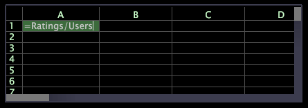

# 工作表{#worksheets}

Data Workbench提供為目前視覺效果建立臨機篩選和量度的工作表。

工作表與一般試算表類似，但與試算表不同，每個包含公式的儲存格都能定義量度。

與使用[!DNL Metric Editor]建立的量度不同，使用工作表定義的量度不會出現在量度功能表中，但可儲存並包含在您的任何工作區中。

有關[!DNL Metric Editor]的資訊，請參閱[建立和編輯衍生量度](../../../../home/c-get-started/c-admin-intrf/c-prof-mgr/c-drvd-mtrcs.md#concept-e41723b342a849309874b26232224a40)。
